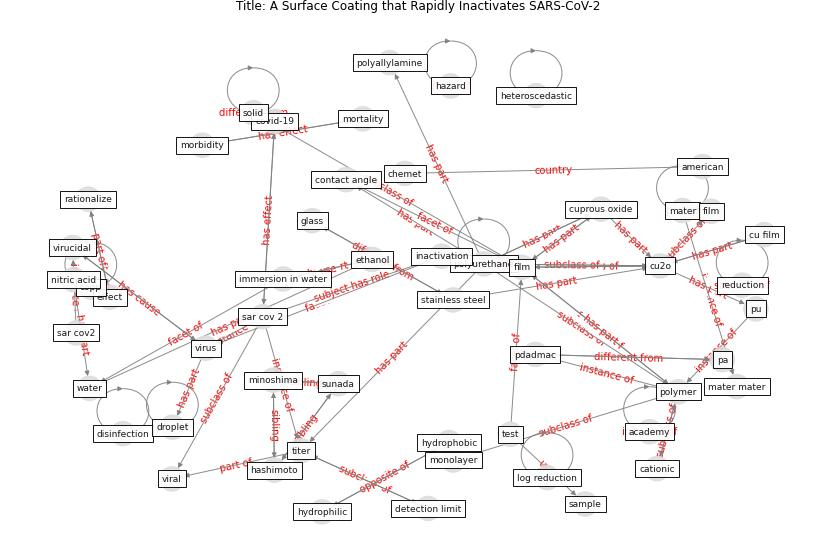

# Article: __A Surface Coating that Rapidly Inactivates SARS-CoV-2__ (behzadinasab_surface_2020)

* [10.1021/acsami.0c11425](https://doi.org/10.1021/acsami.0c11425)
* Cluster: [surface-coating](cluster_11.md)

## Keywords

[polymer](keyword_polymer.md), [virus](keyword_virus.md), [glass](keyword_glass.md), [titer](keyword_titer.md)

## Concepts

 

