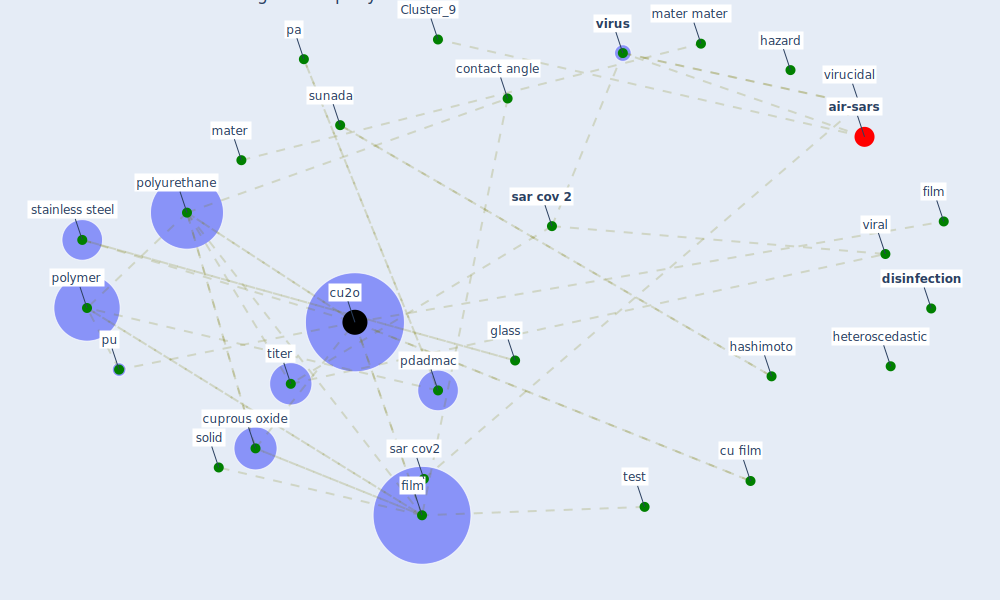

# Article: A Surface Coating that Rapidly Inactivates SARS-CoV-2 (behzadinasab_surface_2020)

* Source: [10.1021/acsami.0c11425](https://doi.org/10.1021/acsami.0c11425)
* Year: 2020
* Cluster: [health-city](cluster_1)

## Keywords

 * 14 chan, 2009 pandemic, [academy](keyword_academy), american, apply material interface, argon plasma, associate content, bare surface, cationic, characterization, chemet, contact angle, copp, [covid-19](keyword_covid-19), cu film, [cu2o](keyword_cu2o), cuprous oxide, detection limit, [disinfection](keyword_disinfection), [droplet](keyword_droplet), durability, easy pure ii unit, electron microscopy, ethanol, effect, fear of touching object, film, fta125, glass, glove, h1n1 influenza virus, hand, hashimoto, hazard, heteroscedastic, [hong kong](keyword_hong_kong), hydrophilic, hydrophobic, immersion in water, inactivate, inactivation, incubate, independent test, [index case](keyword_index_case), [infection](keyword_infection), [influenza](keyword_influenza), [interface](keyword_interface), ljubljana, log reduction, [mater](keyword_mater), mater mater, minoshima, monolayer, morbidity, [mortality](keyword_mortality), nitric acid, one tail, pa, pdadmac, pesticide, polyallylamine, [polymer](keyword_polymer), [polyurethane](keyword_polyurethane), protein, pu, pu film, purifie, rationalize, reduction, [sample](keyword_sample), [sar cov 1](keyword_sar_cov_1), [sar cov 2](keyword_sar_cov_2), [sar cov2](keyword_sar_cov2), sigma aldrich, [slovenia](keyword_slovenia), solid, sonicate, [stainless steel](keyword_stainless_steel), streptomycin, sunada, support information, surfactant, [sweden](keyword_sweden), [test](keyword_test), titer, toxic, toxicol, transmission electron microscopy, uncoated, uncoated solid, [university of hong kong](keyword_university_of_hong_kong), vero e6, [viral](keyword_viral), virginia tech, virucidal, [virus](keyword_virus), [water](keyword_water), wet by water, xu feng, [film](keyword_film)

## Concepts

 

## Neighbours

### Closest articles

* Sars-CoV-2 (COVID-19) inactivation capability of copper-coated touch surface fabricated by cold-spray technology - [LINK](article_hutasoit_sars-cov-2_2020)
* Graphene-based nanomaterials as antimicrobial surface coatings: A parallel approach to restrain the expansion of COVID-19 - [LINK](article_ayub_graphene-based_2021)
* A Continuously Active Antimicrobial Coating effective against Human Coronavirus 229E - [LINK](article_ikner_continuously_2020)
* Aerosol and Surface Stability of SARS-CoV-2 as Compared with SARS-CoV-1 - [LINK](article_van_doremalen_aerosol_2020)
* KIX to apply antimicrobial coating in its fight against COVID-19 - [LINK](article_kansai_airport_kix_2021)
* Persistence of coronaviruses on inanimate surfaces and their inactivation with biocidal agents - [LINK](article_kampf_persistence_2020)
* Sustainability of Coronavirus on Different Surfaces - [LINK](article_suman_sustainability_2020)
* Current knowledge of COVID-19: Advances, challenges and future perspectives - [LINK](article_wu_current_2021)
* COVID-19 Pandemic: Prevention and Protection Measures to Be Adopted at the Workplace - [LINK](article_cirrincione_covid-19_2020)
* COVID-19 and its Modes of Transmission - [LINK](article_karia_covid-19_2020)

### Closest BPs

* Blueprint: Resilience in staffing and skills training - [LINK](bp_12)
* Blueprint: Negative pressure rooms - [LINK](bp_13)
* Blueprint: Smart Locker System - [LINK](bp_1)
