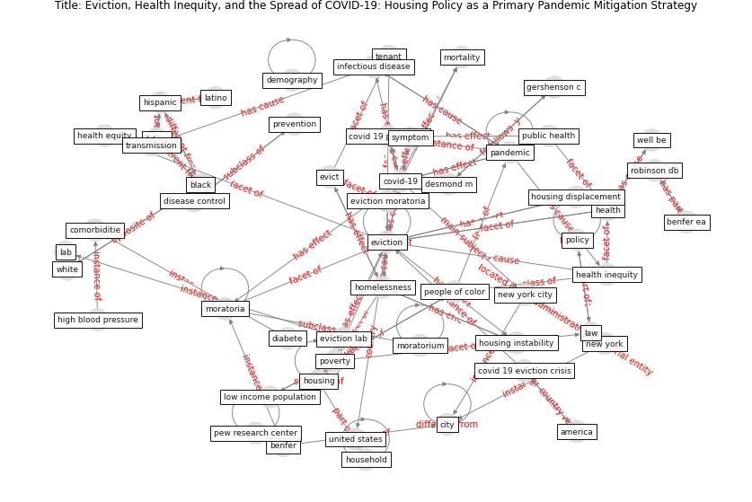

# Article: __Eviction, Health Inequity, and the Spread of COVID-19: Housing Policy as a Primary Pandemic Mitigation Strategy__ (benfer_eviction_2021)

* [10.1007/s11524-020-00502-1](https://doi.org/10.1007/s11524-020-00502-1)
* Cluster: [building-health](cluster_10)

## Keywords

* [eviction](keyword_eviction), [covid-19](keyword_covid-19), [pandemic](keyword_pandemic), [homelessness](keyword_homelessness), [eviction moratoria](keyword_eviction_moratoria), [health](keyword_health), [new york](keyword_new_york), [poverty](keyword_poverty), [prevention](keyword_prevention), black, [housing](keyword_housing), disease control, white, [infectious disease](keyword_infectious_disease), state

## Keywords at large

* [biophilic design](keyword_biophilic_design), [architecture](keyword_architecture), [sustainable architecture](keyword_sustainable_architecture), [nature](keyword_nature), [design](keyword_design), [biophilic](keyword_biophilic), [environ](keyword_environ), [biophilia](keyword_biophilia), [wellbeing](keyword_wellbeing), [health](keyword_health)

## Concepts

 

