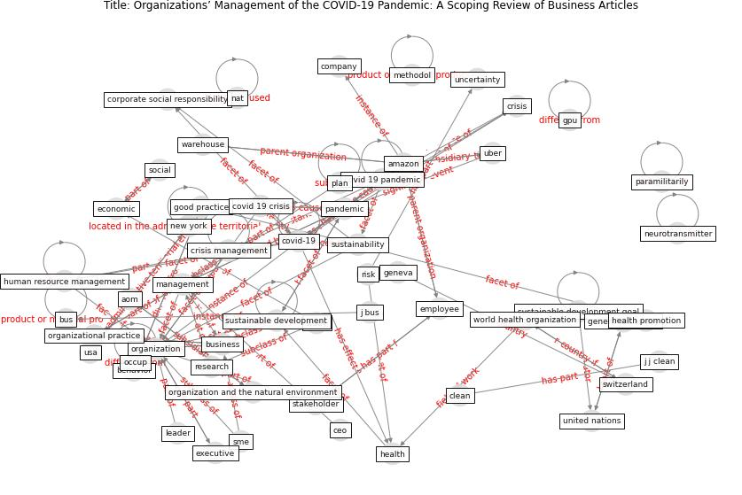

# Article: Organizations’ Management of the COVID-19 Pandemic: A Scoping Review of Business Articles (boiral_organizations_2021)

* Source: [10.3390/su13073993](https://doi.org/10.3390/su13073993)
* Year: 2021
* Cluster: [health-pandemic](cluster_4)

## Keywords

 * academia, academic literature, amazon, aom, behavior, bmc, [bus](keyword_bus), [business](keyword_business), center for disease control and prevention, ceo, [clean](keyword_clean), coder, [company](keyword_company), corporate, corporate social responsibility, corporate sustainability, [covid 19 crisis](keyword_covid_19_crisis), [covid 19 pandemic](keyword_covid_19_pandemic), [covid-19](keyword_covid-19), [crisis](keyword_crisis), crisis management, [economic](keyword_economic), empirical study, [employee](keyword_employee), environmental, [european union](keyword_european_union), executive, [facebook](keyword_facebook), general assembly, geneva, geographical distribution, glass j, global context, good practice, gpu, [health](keyword_health), health promotion, human resource management, [impact](keyword_impact), j bus, j j clean, leader, management, managerial, [manhattan](keyword_manhattan), [mask](keyword_mask), methodol, methodology, morb, mortal, nat, neuropeperous, neurotransmitter, neville s, [new jersey](keyword_new_jersey), [new york](keyword_new_york), [new york city](keyword_new_york_city), newspaper, north america, occup, [organization](keyword_organization), organization and the natural environment, organizational, organizational practice, [pandemic](keyword_pandemic), paramilitarily, pizza hut, [plan](keyword_plan), [research](keyword_research), respirator, respiratory disease, [retail](keyword_retail), [risk](keyword_risk), scope review, sector, [sme](keyword_sme), [social](keyword_social), [social medium](keyword_social_medium), [stakeholder](keyword_stakeholder), strategy environ, [study](keyword_study), [supply chain](keyword_supply_chain), [sustainability](keyword_sustainability), [sustainable development](keyword_sustainable_development), [sustainable development goal](keyword_sustainable_development_goal), [switzerland](keyword_switzerland), systematic review, teleworke, the crisis, [theme](keyword_theme), uber, uncertainty, [united kingdom](keyword_united_kingdom), [united nations](keyword_united_nations), usa, warehouse, world health organization, απώνισμα, چچچ, ḍperp

## Concepts

 

## Neighbours

### Closest articles

* Startups in times of crisis – A rapid response to the COVID-19 pandemic - [LINK](article_kuckertz_startups_2020)
* <scp>COVID</scp>             ‐19: Small and medium enterprises challenges and responses with creativity, innovation, and entrepreneurship - [LINK](article_thukral_covid19_2021)
* Amplifying the role of knowledge translation platforms in the COVID-19 pandemic response - [LINK](article_el-jardali_amplifying_2020)
* A study on office workplace modification during the COVID-19 pandemic in The Netherlands - [LINK](article_hou_study_2021)
* From Viral City to Smart City: Learning from Pandemic Experiences - [LINK](article_sakellarides_viral_2020)
* How COVID-19 Could Accelerate the Adoption of New Retail Technologies and Enhance the (E-)Servicescape - [LINK](article_willems_how_2021)
* It’s time to reimagine where and how work will get done (PwC’s US Remote Work Survey) - [LINK](article_pricewaterhousecoopers_its_2021)
* Retail Signage During the COVID-19 Pandemic - [LINK](article_mcneish_retail_2020)
* The changes in the effects of social media use of Cypriots due to COVID-19 pandemic - [LINK](article_kaya_changes_2020)
* Touchless Retail: What the Rest of the World could learn from China’s new ways to shop - [LINK](article_capgemini_touchless_2020)

### Closest BPs

* Smart Locker System - [LINK](bp_1)
* One-way mobility circulation - [LINK](bp_4)
* Public places as information points - [LINK](bp_8)
