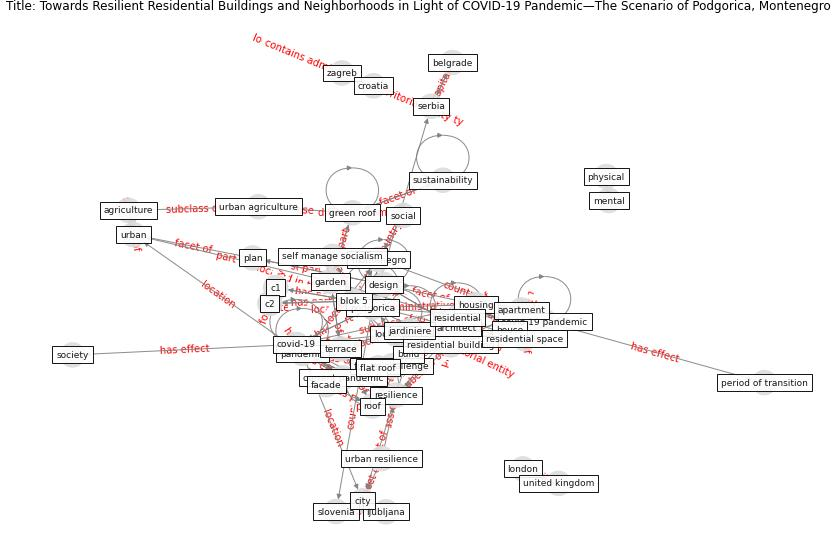

# Article: __Towards Resilient Residential Buildings and Neighborhoods in Light of COVID-19 Pandemic—The Scenario of Podgorica, Montenegro__ (bojovic_towards_2022)

* [10.3390/su14031302](https://doi.org/10.3390/su14031302)
* Cluster: [space-urban](cluster_13)

## Keywords

* [pandemic](keyword_pandemic), [podgorica](keyword_podgorica), [apartment](keyword_apartment), [covid-19](keyword_covid-19), [housing](keyword_housing), [covid 19 pandemic](keyword_covid_19_pandemic), [montenegro](keyword_montenegro), [house](keyword_house), [build](keyword_build), [resilience](keyword_resilience), [lockdown](keyword_lockdown), [architect](keyword_architect), residential building, blok 5, [design](keyword_design)

## Keywords at large

* [biophilic design](keyword_biophilic_design), [architecture](keyword_architecture), [sustainable architecture](keyword_sustainable_architecture), [nature](keyword_nature), [design](keyword_design), [biophilic](keyword_biophilic), [environ](keyword_environ), [biophilia](keyword_biophilia), [wellbeing](keyword_wellbeing), [health](keyword_health)

## Abstract

The COVID-19 crisis and new pandemic-oriented everyday
life have emphasized the urge to reorganize the way we live
and reside, additionally highlighting the already existing
socio-spatial problematic that Montenegrin society has been
experiencing for thirty years. Since residential space is
considered to be vital for physical, mental and social
wellbeing, this sudden and global paradigm shift presents
an opportunity to redefine the current housing concepts
towards greater long-term resilience in the context of
present, pandemic and future challenges. The results of the
survey of housing users in Podgorica confirmed the need to
address this issue. The article discusses a possible model
of resilient adaptation of residential buildings and
neighborhoods in Podgorica, Montenegro. The model addresses
the flexibility of the apartment units, existence of indoor
and outdoor common areas for social activities within the
building and immediate contact with nature, and it is
applicable in the wider territorial context as well.
Formulated with the aim of long-term improvement of the
concept of housing, the model presents a significant
framework for the planning and design of future buildings.
The resilient residential model is tested by its
application to specific buildings of residential area Blok
5 in Podgorica. This leads to the conclusion that the
earlier concepts of housing present in theory and practice
in the second half of the twentieth century in Montenegro
and the region were more adequate in the context of
resilience. As we believe that such improved resilient
housing would consequently increase the resilience of the
community regarding the challenges it faces currently due
to COVID-19, we consider this a long-term contribution of
this research.

## Concepts

 

### References 

* [How is COVID-19 Experience Transforming
Sustainability Requirements of Residential
Buildings? A Review](article_tokazhanov_how_2020)

### Cited by 

* [Prophylactic Architecture: Formulating the Concept
of Pandemic-Resilient Homes](article_elrayies_prophylactic_2022)
