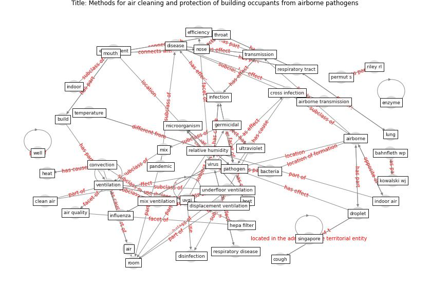

# Article: __Methods for air cleaning and protection of building occupants from airborne pathogens__ (bolashikov_methods_2009)

* [10.1016/j.buildenv.2008.09.001](https://doi.org/10.1016/j.buildenv.2008.09.001)
* Cluster: [air-sars](cluster_2)

## Keywords

[ventilation](keyword_ventilation), [virus](keyword_virus), [disinfection](keyword_disinfection), [infection](keyword_infection), [droplet](keyword_droplet), [transmission](keyword_transmission), [temperature](keyword_temperature), [uvgi](keyword_uvgi), [environment](keyword_environment)

## Abstract

This article aims to draw the attention of the scientific
community towards the elevated risks of airborne
transmission of diseases and the associated risks of
epidemics or pandemics. The complexity of the problem and
the need for multidisciplinary research is highlighted. The
airborne route of transmission, i.e. the generation of
pathogen laden droplets originating in the respiratory
tract of an infected individual, the survivability of the
pathogens, their dispersal indoors and their transfer to a
healthy person are reviewed. The advantages and the
drawbacks of air dilution, filtration, ultraviolet
germicidal irradiation (UVGI), photocatalytic oxidation
(PCO), plasmacluster ions and other technologies for air
disinfection and purification from pathogens are analyzed
with respect to currently used air distribution principles.
The importance of indoor air characteristics, such as
temperature, relative humidity and velocity for the
efficiency of each method is analyzed, taking into
consideration the nature of the pathogens themselves. The
applicability of the cleaning methods to the different
types of total volume air distribution used at present
indoors, i.e. mixing, displacement and underfloor
ventilation, as well as advanced air distribution
techniques (such as personalized ventilation) is
discussed.

## Concepts

 

### References 

* [Role of ventilation in airborne transmission of infectious
agents in the built environment ? a multidisciplinary
systematic review](article_li_role_2007)

### Cited by 

* [A Review on Building Design as a Biomedical
System for Preventing COVID-19 Pandemic](article_amran_review_2022)* [The ventilation of buildings and other mitigating measures
for COVID-19: a focus on wintertime](article_burridge_ventilation_2021)* [Prophylactic Architecture: Formulating the Concept
of Pandemic-Resilient Homes](article_elrayies_prophylactic_2022)* [Indoor Air Quality: Rethinking rules of building
design strategies in post-pandemic architecture](article_megahed_indoor_2021)
