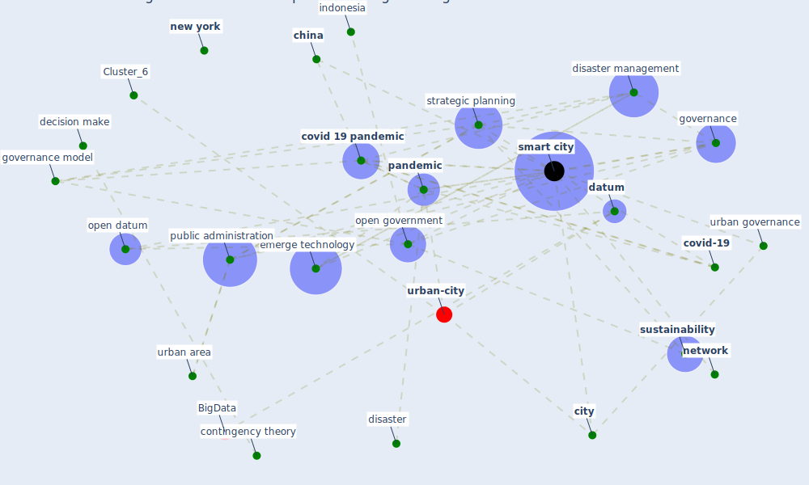

# Article: Learning from the COVID-19 pandemic in governing smart cities (bolivar_learning_2022)

* Source: [10.3233/SCS-210118](https://doi.org/10.3233/SCS-210118)
* Year: 2022
* Cluster: [health-city](cluster_1)

## Keywords

 * administration, andalusia, centralize, [china](keyword_china), citizen, [city](keyword_city), collaborative governance, contingency theory, [covid 19 crisis](keyword_covid_19_crisis), covid 19 disaster recovery, [covid 19 pandemic](keyword_covid_19_pandemic), [covid-19](keyword_covid-19), creative destruction, creative disruption, crisis management, database, [datum](keyword_datum), [decentralize](keyword_decentralize), decentralize decision make, decision make, decision make process, department, dgrl, disaster, disaster management, disruption, e e s, economic disruption, [economy](keyword_economy), emerge technology, [epidemic](keyword_epidemic), [epidemiological](keyword_epidemiological), european recovery program, [germany](keyword_germany), governance, governance model, [government](keyword_government), health pandemic, homepage, [indonesia](keyword_indonesia), [information](keyword_information), information management, information science, information system, [innovation](keyword_innovation), karunasena, [korea](keyword_korea), library science, m gulbrandsen, m keleman, m muna, madrid, makassar, [management](keyword_management), [network](keyword_network), new delhi, [new york](keyword_new_york), [oecd](keyword_oecd), open datum, open government, organisation for economic co operation and development, [organization](keyword_organization), [pandemic](keyword_pandemic), participative, [plan](keyword_plan), policy decision, principalagent theory, [public administration](keyword_public_administration), public governance, public library, public management, public policy, public value, publication date, [recovery](keyword_recovery), regional, scientific paper, scopus, seger, [smart city](keyword_smart_city), smart technology, [society](keyword_society), [spain](keyword_spain), [stakeholder](keyword_stakeholder), strategic alignment, [strategic planning](keyword_strategic_planning), [study](keyword_study), [sustainability](keyword_sustainability), [united kingdom](keyword_united_kingdom), university of granada, university of oxford, urban area, [urban governance](keyword_urban_governance), [urban planning](keyword_urban_planning), [urbanism](keyword_urbanism), vertically, west european politic, why, wise city, wos

## Concepts

 

## Neighbours

### Closest articles

* Future (post-COVID) digital, smart and sustainable cities in the wake of 6G: Digital twins, immersive realities and new urban economies - [LINK](article_allam_future_2021)
* Contributions of Smart City Solutions and Technologies to Resilience against the COVID-19 Pandemic: A Literature Review - [LINK](article_sharifi_contributions_2021)
* The three modes of existence of the pandemic smart city - [LINK](article_soderstrom_three_2021)
* Smart cities and the pandemic: digital technologies on the urban management of Brazilian cities - [LINK](article_fariniuk_smart_2020)
* The Emergence of Anti-Privacy and Control at the Nexus between the Concepts of Safe City and Smart City - [LINK](article_allam_emergence_2019)
* The Smart City and Covid‐19 - [LINK](article_webb_smart_2020)
* On the Coronavirus (COVID-19) Outbreak and the Smart City Network: Universal Data Sharing Standards Coupled with Artificial Intelligence (AI) to Benefit Urban Health Monitoring and Management - [LINK](article_allam_coronavirus_2020)
* Smart cities and a data-driven response to COVID-19 - [LINK](article_james_smart_2020)
* Pandemic stricken cities on lockdown. Where are our planning and design professionals [now, then and into the future]? - [LINK](article_allam_pandemic_2020)
* Proximity and post-COVID-19 urban development: Reflections from Milan, Italy - [LINK](article_tricarico_proximity_2021)

### Closest BPs

* Blueprint: Monitoring of wastewater - [LINK](bp_21)
* Blueprint: Resilience in staffing and skills training - [LINK](bp_12)
* Blueprint: Air Cleaning Plants - [LINK](bp_15)
