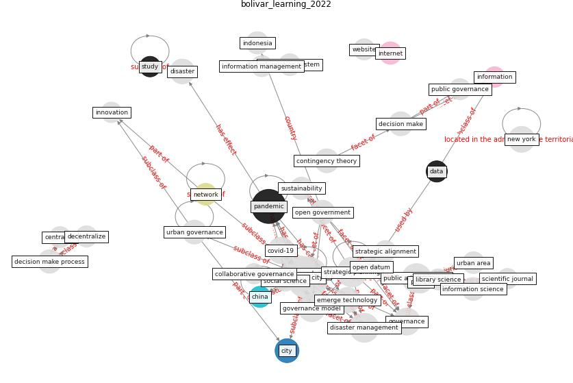

# Article: __Learning from the COVID-19 pandemic in governing smart cities__ (bolivar_learning_2022)

* [10.3233/SCS-210118](https://doi.org/10.3233/SCS-210118)
* Cluster: [smart-datum](cluster_8)

## Keywords

[pandemic](keyword_pandemic)

## Abstract

The COVID-19 pandemic has introduced important challenges
into public management models in all levels of public
administrations, with special focus on the local government
level due to both the impact of pandemics in the local
space and the impact of

## Concepts

 

### References 

* [The Smart City and Covid‐19](article_webb_smart_2020)

### Cited by 

