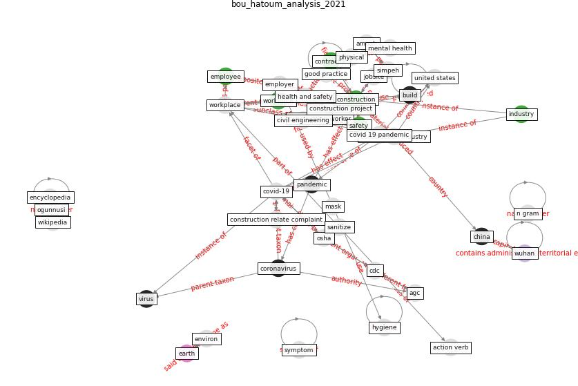

# Article: __Analysis of COVID-19 Concerns Raised by the Construction Workforce and Development of Mitigation Practices__ (bou_hatoum_analysis_2021)

* [10.3389/fbuil.2021.688495](https://doi.org/10.3389/fbuil.2021.688495)
* Cluster: [construction-project](cluster_9)

## Keywords

[construction](keyword_construction), [workplace](keyword_workplace), [safety](keyword_safety), [employee](keyword_employee)

## Abstract

The coronavirus outbreak has created a global health
crisis that has disrupted all industries, including the
construction industry. Following the onset of the pandemic,
construction workers faced and continue to face
unprecedented safety and health challenges. Therefore,
construction employers established new safety precautions
to protect the health and safety of the workforce and
minimize the spread of the virus. The new precautions
followed the advice and guidelines offered by different
health and safety agencies like the Occupational Safety and
Health Administration (OSHA), Centers of Disease Control
and Prevention (CDC), and the Associated General
Contractors of America (AGC). With construction projects
resuming operations, it becomes important to analyze the
coronavirus-related health and safety concerns of
construction workforce and understand how the new safety
procedures can assist on jobsites. Existing studies mostly
focused on interviews and surveys with construction
companies to understand the impact on project performance
and supply chains. However, no study has yet to analyze the
United States construction workforce. This paper fills the
gap by providing a qualitative descriptive analysis of the
COVID-19 complaints data gathered by OSHA from construction
jobsites. Information gathered by OSHA includes the jobsite
location, the North American Industry Classification System
(NAICS) of the construction company, the type of the
complaint (i.e., formal or non-formal), and a thorough
description of the complaint. N-grams were employed to
analyze the complaints, detect trends, and compile a list
of the most frequent concerns reported by the workforce.
The analysis of the complaints data identifies safety
practices that were most violated, highlights major safety
and health concerns for construction workers, and pinpoints
geographical areas that have seen a surge in complaints.
The study also synthesized the existing research corpus and
compiled a list of 100 best practices that construction
employers can adopt to mitigate the concerns of the
workforce. The findings of this study provide insights into
the safety and health trends on construction sites, lay the
foundation for future work of academicians and
practitioners to address the concerns faced by construction
workers, and serve as lessons learned for the industry in
the case of any future pandemic.

## Concepts

 

### References 

* [The Impact of Pandemic Crisis on the Survival of
Construction Industry: A Case of COVID-19](article_gamil_impact_2020)
* [Mechanisms for addressing the impact of COVID-19 on
infrastructure projects](article_king_mechanisms_2021)
* [The Effects of Pandemic on Construction Industry
in the UK](article_shibani_effects_2020)

### Cited by 

* [Influence between COVID-19 Impacts and Project
Stakeholders in Chilean Construction Projects](article_araya_influence_2021)
