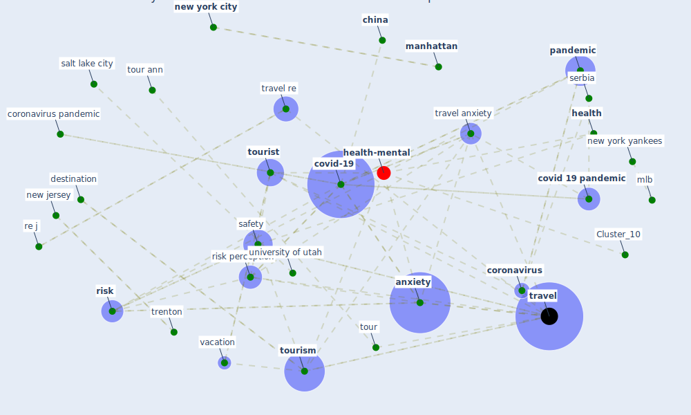

# Article: Should I Stay or Should I Go? Tourists’ COVID-19 Risk Perception and Vacation Behavior Shift (bratic_should_2021)

* Source: [10.3390/su13063573](https://doi.org/10.3390/su13063573)
* Year: 2021
* Cluster: [health-city](cluster_1)

## Keywords

 * 19 of 19 keller, 2 tail, I have disturb thought, [academy](keyword_academy), [anxiety](keyword_anxiety), [australia](keyword_australia), behavior, behaviour, brain behav, cern, chelliah, [china](keyword_china), corona virus pandemic, [coronavirus](keyword_coronavirus), coronavirus pandemic, correlation, [covid 19 pandemic](keyword_covid_19_pandemic), covid 19 risk, covid 19 risk perception, [covid-19](keyword_covid-19), curr, curr curr, descriptive statistic, destination, [factor](keyword_factor), fear, fernando, gender, [germany](keyword_germany), graefe, [health](keyword_health), health risk, [hong kong](keyword_hong_kong), immun, immunologist, [industry](keyword_industry), international, issue tour, juvan, khan, leisure travel, lesjak, less happy than other people, [manhattan](keyword_manhattan), mark twain, mavondo, mlb, nervous, [new jersey](keyword_new_jersey), [new york](keyword_new_york), [new york city](keyword_new_york_city), new york yankees, [pandemic](keyword_pandemic), pap, perception, perception of the covid 19 pandemic factor, peric, prideaux, [psychological](keyword_psychological), re j, regression model, reisinger, [research](keyword_research), [risk](keyword_risk), [risk perception](keyword_risk_perception), risk take, [safety](keyword_safety), salt lake city, satirical, satisfied with myself, satisfy, serbia, serbian, sustain, [sustainable development goal](keyword_sustainable_development_goal), [switzerland](keyword_switzerland), [tour](keyword_tour), tour ann, [tourism](keyword_tourism), tourism industry, tourism provider, tourist, [travel](keyword_travel), travel anxiety, travel behavior, travel decision, travel plan, travel re, travel risk, [trenton](keyword_trenton), [united nations](keyword_united_nations), [united states](keyword_united_states), university of utah, [usa](keyword_usa), vacation, vacation behavior, vacation plan, [virus](keyword_virus), worldwide pandemic, zhejiang

## Concepts

 

## Neighbours

### Closest articles

* Seeing the invisible hand: Underlying effects of COVID-19 on tourists’ behavioral patterns - [LINK](article_li_seeing_2020)
* The psychological impact of COVID-19 on the mental health in the general population - [LINK](article_serafini_psychological_2020)
* Psychological Effects of Home Confinement and Social Distancing Derived from COVID-19 in the General Population—A Systematic Review - [LINK](article_rodriguez-fernandez_psychological_2021)
* Mobility Behaviour in View of the Impact of the COVID-19 Pandemic—Public Transport Users in Gdansk Case Study - [LINK](article_przybylowski_mobility_2021)
* Responsible Transport: A post-COVID agenda for transport policy and practice - [LINK](article_budd_responsible_2020)
* Indirect effects of COVID-19 on the environment - [LINK](article_zambrano-monserrate_indirect_2020)
* Nurture to nature via COVID-19, a self-regenerating environmental strategy of environment in global context - [LINK](article_paital_nurture_2020)
* The socio-economic implications of the coronavirus pandemic (COVID-19): A review - [LINK](article_nicola_socio-economic_2020)
* From Viral City to Smart City: Learning from Pandemic Experiences - [LINK](article_sakellarides_viral_2020)
* Amplifying the role of knowledge translation platforms in the COVID-19 pandemic response - [LINK](article_el-jardali_amplifying_2020)

### Closest BPs

* Blueprint: Resilience in staffing and skills training - [LINK](bp_12)
* Blueprint: Installing UV in ductwork - [LINK](bp_10)
* Blueprint: Installing high-efficiency air filters - [LINK](bp_11)
