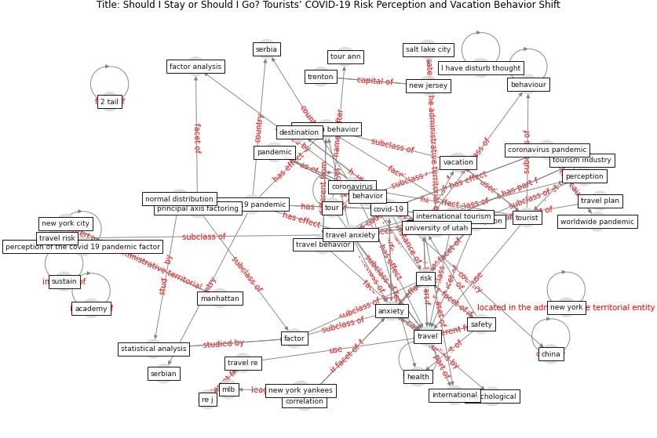

# Article: Should I Stay or Should I Go? Tourists’ COVID-19 Risk Perception and Vacation Behavior Shift (bratic_should_2021)

* Source: [10.3390/su13063573](https://doi.org/10.3390/su13063573)
* Year: 2021
* Cluster: [health-patient](cluster_14)

## Keywords

 * 19 of 19 keller, 2 tail, I have disturb thought, [academy](keyword_academy), [anxiety](keyword_anxiety), [australia](keyword_australia), behavior, behaviour, brain behav, cern, chelliah, [china](keyword_china), corona virus pandemic, [coronavirus](keyword_coronavirus), coronavirus pandemic, correlation, [covid 19 pandemic](keyword_covid_19_pandemic), covid 19 risk, covid 19 risk perception, [covid-19](keyword_covid-19), curr, curr curr, descriptive statistic, destination, factor, [fear](keyword_fear), fernando, gender, [germany](keyword_germany), graefe, [health](keyword_health), health risk, [hong kong](keyword_hong_kong), immun, immunologist, [industry](keyword_industry), [international](keyword_international), issue tour, juvan, khan, leisure travel, lesjak, less happy than other people, [manhattan](keyword_manhattan), mark twain, mavondo, mlb, nervous, [new jersey](keyword_new_jersey), [new york](keyword_new_york), [new york city](keyword_new_york_city), new york yankees, [pandemic](keyword_pandemic), pap, perception, perception of the covid 19 pandemic factor, peric, prideaux, [psychological](keyword_psychological), re j, regression model, reisinger, [research](keyword_research), [risk](keyword_risk), [risk perception](keyword_risk_perception), risk take, [safety](keyword_safety), salt lake city, satirical, satisfied with myself, satisfy, serbia, serbian, sustain, [sustainable development goal](keyword_sustainable_development_goal), [switzerland](keyword_switzerland), [tour](keyword_tour), tour ann, [tourism](keyword_tourism), tourism industry, tourism provider, tourist, [travel](keyword_travel), travel anxiety, travel behavior, travel decision, travel plan, travel re, travel risk, [trenton](keyword_trenton), [united nations](keyword_united_nations), [united states](keyword_united_states), university of utah, [usa](keyword_usa), vacation, vacation behavior, vacation plan, [virus](keyword_virus), worldwide pandemic, zhejiang

## Concepts

 

## Neighbours

### Closest articles

* Seeing the invisible hand: Underlying effects of COVID-19 on tourists’ behavioral patterns - [LINK](article_li_seeing_2020)
* Pandemiens arkitektur - [LINK](article_realdania_pandemiens_2022)
* Refleksioner fra en pandemi - [LINK](article_realdania_refleksioner_2022)
* How Can Blockchain Help People in the Event of Pandemics Such as the COVID-19? - [LINK](article_chang_how_2020)
* Blockchain technology and its applications to combat COVID-19 pandemic - [LINK](article_sharma_blockchain_2022)
* Health Information Exchange with Blockchain amid Covid-19-like Pandemics - [LINK](article_christodoulou_health_2020)
* Pandemic stricken cities on lockdown. Where are our planning and design professionals [now, then and into the future]? - [LINK](article_allam_pandemic_2020)
* Validity of energy social research during and after COVID-19: challenges, considerations, and responses - [LINK](article_fell_validity_2020)
* Contextualizing the Covid-19 pandemic for a carbon-constrained world: Insights for sustainability transitions, energy justice, and research methodology - [LINK](article_sovacool_contextualizing_2020)
* Covid-19 and the politics of sustainable energy transitions - [LINK](article_kuzemko_covid-19_2020)

### Closest BPs

* Blueprint: Monitoring of wastewater - [LINK](bp_21)
* Blueprint: Mental health – Act: Do something - [LINK](bp_18)
* Blueprint: Mental health – Belong: Do something with someone - [LINK](bp_19)
