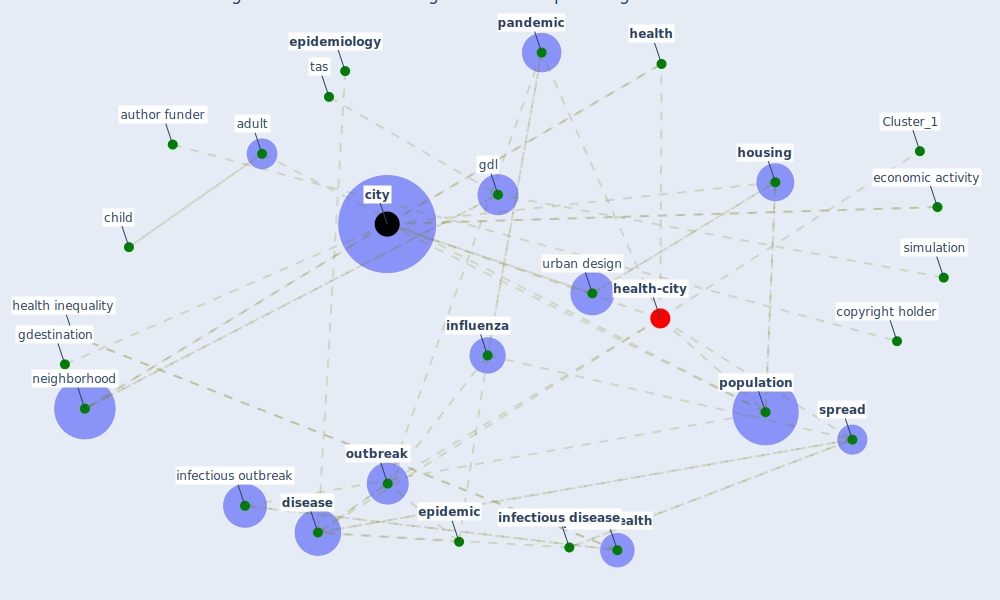

# Article: Understanding the role of urban design in disease spreading (brizuela_understanding_2019)

* Source: [10.1101/766667](https://doi.org/10.1101/766667)
* Year: 2019
* Cluster: [health-city](cluster_1)

## Keywords

 * activity hub, adult, age, agent base model, agglomeration, [author funder](keyword_author_funder), barrat a, bedford vl, census, [child](keyword_child), [city](keyword_city), city center, colizza v, contagion, [copyright holder](keyword_copyright_holder), [density](keyword_density), [diagnosis](keyword_diagnosis), diehl j, [disease](keyword_disease), disease spread, dω, dω0, ecology, [economic](keyword_economic), economic activity, economic datum, [education](keyword_education), ellner sp, [environment](keyword_environment), [epidemic](keyword_epidemic), epidemic growth, [epidemiological](keyword_epidemiological), epidemiologist, [epidemiology](keyword_epidemiology), equation 3, estadı stica, eubank s, flu, gdestination, gdl, geografı a, gorigin, gravity model, guadalajara, [health](keyword_health), health inequality, [heterogeneity](keyword_heterogeneity), [housing](keyword_housing), hub, human mobility, [infect](keyword_infect), [infectious disease](keyword_infectious_disease), infectious outbreak, infective, [influenza](keyword_influenza), interaction kernel, land use, material and method, mathematical, metapopulation, metropolitan area, mexico, [mobility](keyword_mobility), [nature](keyword_nature), [neighborhood](keyword_neighborhood), origin destination density function, [outbreak](keyword_outbreak), [pandemic](keyword_pandemic), [pathogen](keyword_pathogen), place of residence, [population](keyword_population), population average, population density, population size, pourbohloul b, press, probability, probability density function, ps, [public health](keyword_public_health), r0, reproduction number, [research](keyword_research), roberts ms, science, [simulation](keyword_simulation), [social](keyword_social), [spread](keyword_spread), spread of disease, stehle, suburb, susceptible, tas, theoretical, timestep, [treatment](keyword_treatment), urban design, urban geography, urbanization, ω0

## Concepts

 

## Neighbours

### Closest articles

* Association of built environment attributes with the spread of COVID-19 at its initial stage in China - [LINK](article_li_association_2021)
* Urban design attributes and resilience: COVID-19 evidence from New York City - [LINK](article_yang_urban_2021)
* Treating two pandemics for the price of one: Chronic and infectious disease impacts of the built and natural environment - [LINK](article_frank_treating_2021)
* Eviction, Health Inequity, and the Spread of COVID-19: Housing Policy as a Primary Pandemic Mitigation Strategy - [LINK](article_benfer_eviction_2021)
* The socio-economic determinants of COVID-19: A spatial analysis of German county level data - [LINK](article_ehlert_socio-economic_2021)
* COVID19-Routes: A Safe Pedestrian Navigation Service - [LINK](article_cantarero_covid19-routes_2021)
* Dangerous liaisons? Applying the social harm perspective to the social inequality, housing and health trifecta during the Covid-19 pandemic - [LINK](article_gurney_dangerous_2021)
* Questioning the use of the balcony in apartments during the COVID-19 pandemic process - [LINK](article_aydin_questioning_2020)
* The City Under COVID‐19: Podcasting As Digital Methodology - [LINK](article_rogers_city_2020)

### Closest BPs

* Blueprint: Resilience in staffing and skills training - [LINK](bp_12)
* Blueprint: Installing high-efficiency air filters - [LINK](bp_11)
* Blueprint: Air Cleaning Plants - [LINK](bp_15)
