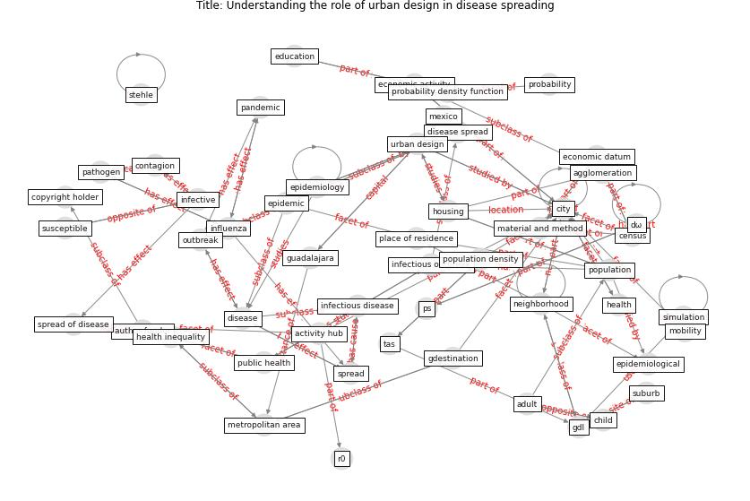

# Article: Understanding the role of urban design in disease spreading (brizuela_understanding_2019)

* Source: [10.1101/766667](https://doi.org/10.1101/766667)
* Year: 2019
* Cluster: [city-urban](cluster_7)

## Keywords

 * [acc by 4 0](keyword_acc_by_4_0), activity hub, adult, agent base model, agglomeration, attack rate, [author funder](keyword_author_funder), barrat a, bedford vl, biological science, biology, census, child, [city](keyword_city), city center, contagion, [copyright holder](keyword_copyright_holder), [density](keyword_density), [disease](keyword_disease), disease spread, dω, dω0, ecology, [economic](keyword_economic), economic activity, economic datum, [education](keyword_education), ellner sp, [environment](keyword_environment), [epidemic](keyword_epidemic), epidemic growth, [epidemiological](keyword_epidemiological), [epidemiology](keyword_epidemiology), equation 3, estadı stica, eubank s, flu, gdestination, gdl, geografı a, gini coefficient, gorigin, gravity model, guadalajara, [health](keyword_health), health inequality, homogeneous mix condition, [housing](keyword_housing), hub, human mobility, [infectious disease](keyword_infectious_disease), infectious outbreak, infective, [influenza](keyword_influenza), interaction kernel, [international license](keyword_international_license), land use, material and method, medicine, metapopulation, metropolitan area, mexico, [mobility](keyword_mobility), national academy of sciences, [nature](keyword_nature), [neighborhood](keyword_neighborhood), numerical grid, [outbreak](keyword_outbreak), [pandemic](keyword_pandemic), [pathogen](keyword_pathogen), place of residence, [population](keyword_population), population average, population density, population size, pourbohloul b, press, probability, probability density function, ps, [public health](keyword_public_health), r0, reproduction number, [research](keyword_research), science, [simulation](keyword_simulation), [social](keyword_social), [social science](keyword_social_science), [spread](keyword_spread), spread of disease, stehle, suburb, susceptible, tas, timestep, treatment, urban design, urban geography, urbanization, ω0

## Concepts

 

## Neighbours

### Closest articles

* Towards the sustainable development of smart cities through mass video surveillance: A response to the COVID-19 pandemic - [LINK](article_shorfuzzaman_towards_2021)
*  - [LINK](article_huy-tran_design_2022)
* Drones. Disinfecting robots. Supercomputers. The coronavirus outbreak is a test for China's tech industry \textbar CNN Business - [LINK](article_wang_drones_2020)
* DeepSOCIAL: Social Distancing Monitoring and Infection Risk Assessment in COVID-19 Pandemic - [LINK](article_rezaei_deepsocial_2020)
* Danish disinfection robots save lives in the fight against the Corona virus \textbar Shaping Europe’s digital future - [LINK](article_ec_views_danish_2020)
* Combating COVID-19—The role of robotics in managing public health and infectious diseases - [LINK](article_yang_combating_2020)
* Recently employed engineering techniques to reduce the spread of COVID-19 (corona virus disease 2019): a review study - [LINK](article_saman_recently_2021)
* 10 tech trends getting us through the COVID-19 pandemic - [LINK](article_yan_10_2020)
* An Overview of Ontologies and Tool Support for COVID-19 Analytics - [LINK](article_ahmad_overview_2021)

### Closest BPs

* Mental health – Act: Do something - [LINK](bp_18)
* Good hand hygiene practice - [LINK](bp_16)
* Antimicrobial Surfaces - [LINK](bp_5)
