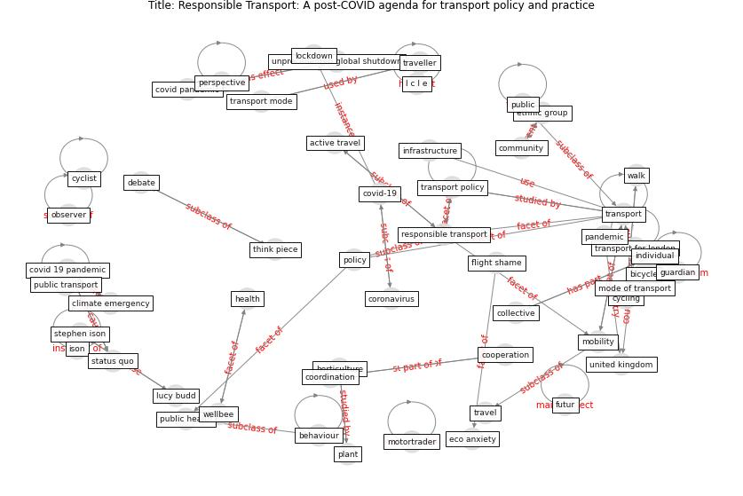

# Article: Responsible Transport: A post-COVID agenda for transport policy and practice (budd_responsible_2020)

* Source: [10.1016/j.trip.2020.100151](https://doi.org/10.1016/j.trip.2020.100151)
* Year: 2020
* Cluster: [city-health](cluster_14)

## Keywords

 * I c l e, active travel, air france, airline, asda, avoid use, behaviour, bicycle, bird, birdsong, [climate change](keyword_climate_change), climate emergency, collective, [community](keyword_community), cooperation, coordination, [coronavirus](keyword_coronavirus), [covid 19 pandemic](keyword_covid_19_pandemic), covid pandemic, [covid-19](keyword_covid-19), cycling, cyclist, daily routine, debate, decision maker, digital transport, disc, door, drive search, e scooter, eco anxiety, ethnic group, ethnic minority, [europe](keyword_europe), externality, french government, futur, gender equality, global health, global pandemic, global public health crisis, green recovery, greenhouse gas emission, guardian, hand sanitizer, [health](keyword_health), horticulture, individual, individual choice, [infrastructure](keyword_infrastructure), institutional, isolate and shield themselves and their family from other, ison, [lockdown](keyword_lockdown), lucy budd, [mobility](keyword_mobility), mode of transport, motortrader, observer, [online shopping](keyword_online_shopping), onus, [pandemic](keyword_pandemic), panic buying, [perspective](keyword_perspective), [plant](keyword_plant), [policy](keyword_policy), policy making, policy press, pollution, positive change, post covid world, pract, psychol, [public](keyword_public), public acceptance, [public health](keyword_public_health), public mode of transport, [public transport](keyword_public_transport), rapid long distance international mobility, response to covid 19, [responsible transport](keyword_responsible_transport), [rio de janeiro](keyword_rio_de_janeiro), [risk](keyword_risk), [social distancing](keyword_social_distancing), status quo, stephen ison, think piece, [transport](keyword_transport), transport for london, transport mode, [transport policy](keyword_transport_policy), [travel](keyword_travel), travel medicine, traveller, [united kingdom](keyword_united_kingdom), unprecedented global shutdown, use car, walk, [wellbee](keyword_wellbee), flight shame

## Concepts

 

## Neighbours

### Closest articles

* Mobility Behaviour in View of the Impact of the COVID-19 Pandemic—Public Transport Users in Gdansk Case Study - [LINK](article_przybylowski_mobility_2021)
* Urban planning after COVID-19 - [LINK](article_rtpi_urban_2021)
* Proximity and post-COVID-19 urban development: Reflections from Milan, Italy - [LINK](article_tricarico_proximity_2021)
* The Smart City and Covid‐19 - [LINK](article_webb_smart_2020)
* The three modes of existence of the pandemic smart city - [LINK](article_soderstrom_three_2021)
* Global policy challenges for urban vector-borne disease risks - [LINK](article_alabaster_global_2016)
* The Emergence of Anti-Privacy and Control at the Nexus between the Concepts of Safe City and Smart City - [LINK](article_allam_emergence_2019)
* On the Coronavirus (COVID-19) Outbreak and the Smart City Network: Universal Data Sharing Standards Coupled with Artificial Intelligence (AI) to Benefit Urban Health Monitoring and Management - [LINK](article_allam_coronavirus_2020)
* Smart cities and the pandemic: digital technologies on the urban management of Brazilian cities - [LINK](article_fariniuk_smart_2020)

### Closest BPs

* Blueprint: Architecture design - [LINK](bp_2)
* Blueprint: Building Adaptation during a pandemic - [LINK](bp_14)
* Blueprint: Tender support at building stage - [LINK](bp_9)
