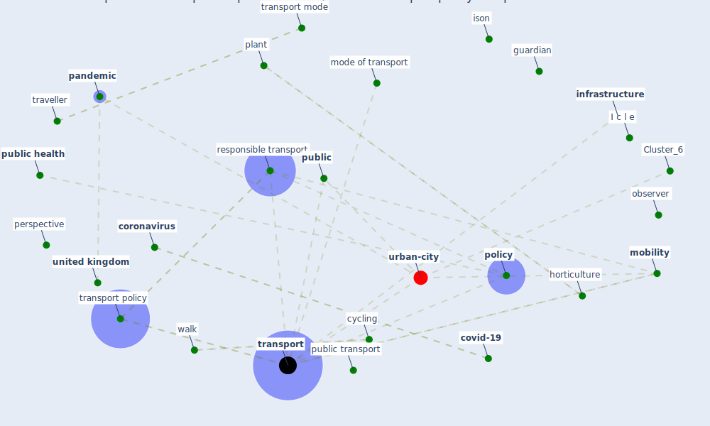

# Article: Responsible Transport: A post-COVID agenda for transport policy and practice (budd_responsible_2020)

* Source: [10.1016/j.trip.2020.100151](https://doi.org/10.1016/j.trip.2020.100151)
* Year: 2020
* Cluster: [health-city](cluster_1)

## Keywords

 * I c l e, active travel, airline, asda, asymmetric information, autonomous actor, behaviour, bicycle, bird, birdsong, [brazil](keyword_brazil), bristol, [bus](keyword_bus), business as usual, [china](keyword_china), [climate change](keyword_climate_change), collective, [community](keyword_community), consumer safety, cooperation, coordination, [coronavirus](keyword_coronavirus), [covid 19 pandemic](keyword_covid_19_pandemic), covid pandemic, [covid-19](keyword_covid-19), [cycling](keyword_cycling), cyclist, daily routine, debate, decision maker, disc, [door](keyword_door), drive search, e scooter, eco anxiety, ethnic group, ethnic minority, [europe](keyword_europe), externality, french government, futur, gender equality, green recovery, greenhouse gas emission, guardian, hand sanitizer, [health](keyword_health), horticulture, incubation period, individual, [infrastructure](keyword_infrastructure), interdisc, isolate and shield themselves and their family from other, ison, leg, leisure centre, [lockdown](keyword_lockdown), [london](keyword_london), lucy budd, [mobility](keyword_mobility), mode of transport, motortrader, movement of good, observer, online shopping, onus, [pandemic](keyword_pandemic), panic buying, [perspective](keyword_perspective), [plant](keyword_plant), [policy](keyword_policy), policy press, [pollution](keyword_pollution), positive change, post covid world, pract, [public](keyword_public), public acceptance, [public health](keyword_public_health), public mode of transport, [public transport](keyword_public_transport), response to covid 19, [responsible transport](keyword_responsible_transport), rio de janeiro, status quo, stephen ison, think piece, [transport](keyword_transport), transport debate, transport focus, transport for london, transport mode, [transport policy](keyword_transport_policy), traveller, [united kingdom](keyword_united_kingdom), [virus](keyword_virus), visor, walk, [wellbee](keyword_wellbee), flight shame

## Concepts

 

## Neighbours

### Closest articles

* Mobility Behaviour in View of the Impact of the COVID-19 Pandemic—Public Transport Users in Gdansk Case Study - [LINK](article_przybylowski_mobility_2021)
* From Viral City to Smart City: Learning from Pandemic Experiences - [LINK](article_sakellarides_viral_2020)
* The socio-economic implications of the coronavirus pandemic (COVID-19): A review - [LINK](article_nicola_socio-economic_2020)
* Amplifying the role of knowledge translation platforms in the COVID-19 pandemic response - [LINK](article_el-jardali_amplifying_2020)
* Should I Stay or Should I Go? Tourists’ COVID-19 Risk Perception and Vacation Behavior Shift - [LINK](article_bratic_should_2021)
* Seeing the invisible hand: Underlying effects of COVID-19 on tourists’ behavioral patterns - [LINK](article_li_seeing_2020)
* The COVID-19 pandemic: Lessons on building more equal and sustainable societies - [LINK](article_van_barneveld_covid-19_2020)
* A critical analysis of the impacts of COVID-19 on the global economy and ecosystems and opportunities for circular economy strategies - [LINK](article_ibn-mohammed_critical_2021)
* COVID-19 and the UN Sustainable Development Goals: Threat to Solidarity or an Opportunity? - [LINK](article_leal_filho_covid-19_2020)
* Building up an ecologically sustainable and socially desirable post-COVID-19 future - [LINK](article_duflot_building_2021)

### Closest BPs

* Blueprint: Resilience in staffing and skills training - [LINK](bp_12)
* Blueprint: Monitoring of wastewater - [LINK](bp_21)
* Blueprint: Installing high-efficiency air filters - [LINK](bp_11)
