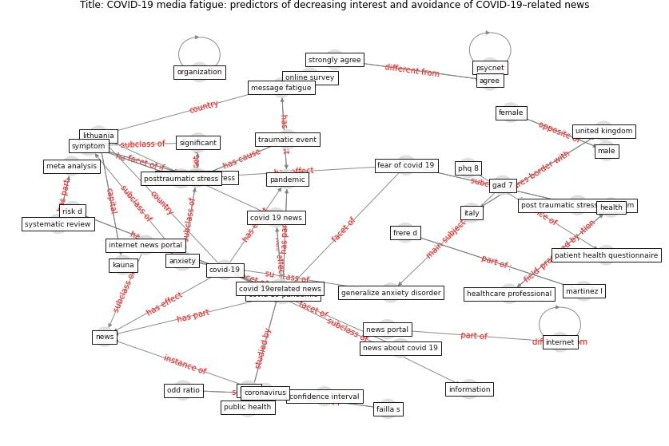

# Article: __COVID-19 media fatigue: predictors of decreasing interest and avoidance of COVID-19–related news__ (buneviciene_covid-19_2021)

* [10.1016/j.puhe.2021.05.024](https://doi.org/10.1016/j.puhe.2021.05.024)
* Cluster: [health-building](cluster_9)

## Keywords

* [covid-19](keyword_covid-19), [covid 19 pandemic](keyword_covid_19_pandemic), [post traumatic stress](keyword_post_traumatic_stress), [internet](keyword_internet), [news](keyword_news), [pandemic](keyword_pandemic), [lithuania](keyword_lithuania), [health](keyword_health), [symptom](keyword_symptom), [kauna](keyword_kauna), [coronavirus](keyword_coronavirus), fear of covid 19, pre exist condition, [public health](keyword_public_health), news portal

## Keywords at large

* [internet](keyword_internet), [covid-19](keyword_covid-19), [covid 19 pandemic](keyword_covid_19_pandemic), [post traumatic stress](keyword_post_traumatic_stress), [news](keyword_news), [health](keyword_health), [lithuania](keyword_lithuania), [pandemic](keyword_pandemic), [symptom](keyword_symptom), [kauna](keyword_kauna)

## Concepts

 

### Closest articles 

* [The impacts of knowledge, risk perception, emotion and information on citizens’ protective behaviors during the outbreak of COVID-19: a cross-sectional study in China](article_ning_impacts_2020)
* [Psychological Effects of Home Confinement and Social Distancing Derived from COVID-19 in the General Population—A Systematic Review](article_rodriguez-fernandez_psychological_2021)
* [What drives unverified information sharing and cyberchondria during the COVID-19 pandemic?](article_laato_what_2020)
* [The changes in the effects of social media use of Cypriots due to COVID-19 pandemic](article_kaya_changes_2020)
* [COVID-19 misinformation: Accuracy of articles about coronavirus prevention mostly shared on social media](article_obiala_covid-19_2021)
* [Mental Health and the Covid-19 Pandemic](article_pfefferbaum_mental_2020)
* [Mental health and COVID-19](article_who_mental_2021)
* [Home garden use during COVID-19: Associations with physical and mental wellbeing in older adults](article_corley_home_2021)
* [Blockchain technology and its applications to combat COVID-19 pandemic](article_sharma_blockchain_2022)
* [Coronavirus: Can artificial intelligence be smart enough
to detect fake news?](article_tong_coronavirus_2020)

