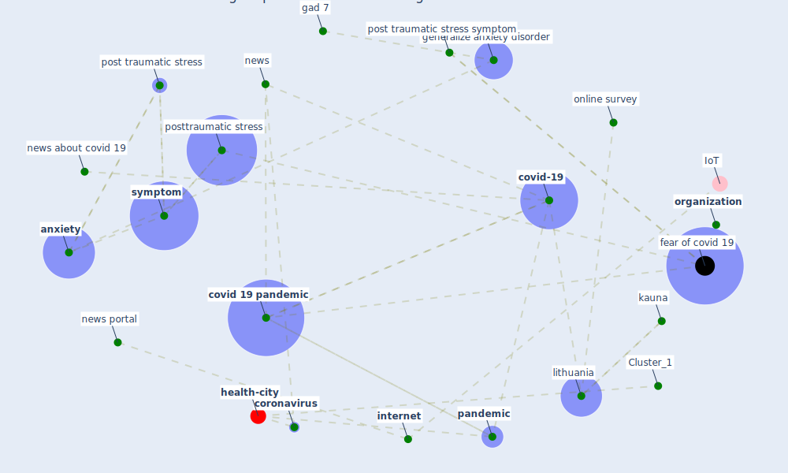

# Article: COVID-19 media fatigue: predictors of decreasing interest and avoidance of COVID-19–related news (buneviciene_covid-19_2021)

* Source: [10.1016/j.puhe.2021.05.024](https://doi.org/10.1016/j.puhe.2021.05.024)
* Year: 2021
* Cluster: [health-city](cluster_1)

## Keywords

 * 95 ci, acute stress, [agree](keyword_agree), [anxiety](keyword_anxiety), avoidant, [bank](keyword_bank), behaviour, bell r, boston marathon bombing, climate change communication, climatecommunication, compete interest, confidence interval, cope strategy, [coronavirus](keyword_coronavirus), coronavirus disease, covid 19 news, [covid 19 pandemic](keyword_covid_19_pandemic), covid 19erelated news, [covid-19](keyword_covid-19), [depression](keyword_depression), desensitisation, e mail address, email address, failla s, fear of covid 19, female, frere d, gad 2, gad 7, generalize anxiety disorder, haart, [health](keyword_health), health information, healthcare professional, henry rs, [information](keyword_information), informed consent, interest level lose interest in covid 19, [internet](keyword_internet), internet news portal, ironson g, [italy](keyword_italy), kauna, kroenke k, kwakkenbo l, lithuania, male, martinez l, message fatigue, [meta analysis](keyword_meta_analysis), molla, molla r, naftel d, nber org, [news](keyword_news), news about covid 19, news headline, news portal, news source, odd ratio, online survey, [organization](keyword_organization), [pandemic](keyword_pandemic), pandemic fatigue, part twosource of health information, patient health questionnaire, penedo f, perceive health status, phq 8, [post traumatic stress](keyword_post_traumatic_stress), post traumatic stress symptom, posttraumatic stress, pre exist condition, psycnet, [public health](keyword_public_health), [research](keyword_research), [risk](keyword_risk), risk d, sehgal, significant, significant stress, standard deviation, statistic, statistical, strine tw, strongly agree, [study](keyword_study), [symptom](keyword_symptom), systematic review, traumatic event, [united kingdom](keyword_united_kingdom), [united states](keyword_united_states), vytautas magnus university, w28110, [washington](keyword_washington), we b, when will the covid 19 pandemic end, who timeline, world

## Concepts

 

## Neighbours

### Closest articles

* What drives unverified information sharing and cyberchondria during the COVID-19 pandemic? - [LINK](article_laato_what_2020)
* The changes in the effects of social media use of Cypriots due to COVID-19 pandemic - [LINK](article_kaya_changes_2020)
* COVID-19 misinformation: Accuracy of articles about coronavirus prevention mostly shared on social media - [LINK](article_obiala_covid-19_2021)
* Infodemic and the spread of fake news in the COVID-19-era - [LINK](article_orso_infodemic_2020)
* The impacts of knowledge, risk perception, emotion and information on citizens’ protective behaviors during the outbreak of COVID-19: a cross-sectional study in China - [LINK](article_ning_impacts_2020)
* Mental health and COVID-19 - [LINK](article_who_mental_2021)
* Coronavirus: Can artificial intelligence be smart enough to detect fake news? - [LINK](article_tong_coronavirus_2020)
* Mental Health and the Covid-19 Pandemic - [LINK](article_pfefferbaum_mental_2020)
* Knowledge, attitudes, and practices of Indonesian residents regarding COVID-19: A national cross-sectional survey - [LINK](article_yodang_knowledge_2021)
* Mental health economics: A prospective study on psychological flourishing and associations with healthcare costs and sickness benefit transfers in Denmark - [LINK](article_santini_mental_2021)

### Closest BPs

* Blueprint: Resilience in staffing and skills training - [LINK](bp_12)
* Blueprint: Installing UV in ductwork - [LINK](bp_10)
* Blueprint: Installing high-efficiency air filters - [LINK](bp_11)
