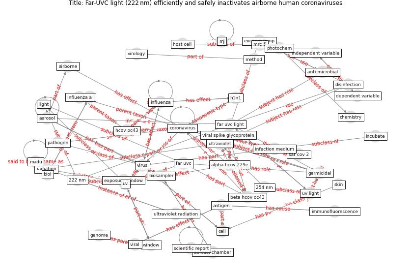

# Article: Far-UVC light (222 nm) efficiently and safely inactivates airborne human coronaviruses (buonanno_far-uvc_2020)

* Source: [10.1038/s41598-020-67211-2](https://doi.org/10.1038/s41598-020-67211-2)
* Year: 2020
* Cluster: [uvc-hcov](cluster_7)

## Keywords

 * 222 nm, 254 nm, [aerosol](keyword_aerosol), aerosol chamber, [airborne](keyword_airborne), alexa fluor 488, alpha hcov 229e, anti microbial, antigen, [assay](keyword_assay), [bacteria](keyword_bacteria), beta hcov oc43, biol, [biosampler](keyword_biosampler), [cell](keyword_cell), chemical substance, chemistry, chromosome, cm2, columbia university, [coronavirus](keyword_coronavirus), cough, [covid-19](keyword_covid-19), cytoplasm, d 90, dapi, [datum](keyword_datum), dependent variable, [disinfection](keyword_disinfection), [domain](keyword_domain), dosimetry, epidermal, excimer lamp, exposure window, far uvc, far uvc light, fibroblast, first order kinetic, [genome](keyword_genome), genomic, [germicidal](keyword_germicidal), h1n1, hbss, hcov oc43, host cell, human lung cell, immunofluorescence, in vitro, in vivo, [inactivation](keyword_inactivation), incubate, independent variable, infection medium, [influenza](keyword_influenza), influenza a, influenza v irus23, irradiation chamber, [light](keyword_light), linear regression, madu, mem, method, [mj](keyword_mj), mol, mouth breathing, mrc 5, objective, [pathogen](keyword_pathogen), photochem, photodetector, plaque form unit, poisson distribution, principle, protein, radiat, radiation, robust linear regression, [sar cov 2](keyword_sar_cov_2), scientific report, secondary antibody, skin, statistic, statistical analysis, stratum corneum, [study](keyword_study), susceptibility factor, t esting23, tissue, [ultraviolet](keyword_ultraviolet), ultraviolet radiation, ushio inc, [uv](keyword_uv), uv inactivation rate constant, [uv light](keyword_uv_light), va, [viral](keyword_viral), viral spike glycoprotein, virology, [virus](keyword_virus), [window](keyword_window)

## Concepts

 

## Neighbours

### Closest articles

* Efficacy of an Automated Multiple Emitter Whole-Room Ultraviolet-C Disinfection System Against Coronaviruses MHV and MERS-CoV - [LINK](article_bedell_efficacy_2016)
* Effect of Ultraviolet Germicidal Irradiation on Viral Aerosols - [LINK](article_walker_effect_2007)
* Recently employed engineering techniques to reduce the spread of COVID-19 (corona virus disease 2019): a review study - [LINK](article_saman_recently_2021)
* Upper-room ultraviolet air disinfection might help to reduce COVID-19 transmission in buildings: a feasibility study - [LINK](article_beggs_upper-room_2020)
* Case Study: Using Germicidal UV-C to Mitigate COVID-19 - HVAC - [LINK](article_healthcare_facilities_today_case_2021)
* Behind the Update: ASHRAE Handbook Chapters on UV-C to Include Updated Best Practices, Guidance - [LINK](article_ashrae_behind_2020)
* Upper-Room Ultraviolet Light and Negative Air Ionization to Prevent Tuberculosis Transmission - [LINK](article_escombe_upper-room_2009)
* Applications of ultraviolet germicidal irradiation disinfection in health care facilities: Effective adjunct, but not stand-alone technology - [LINK](article_memarzadeh_applications_2010)
* Air Disinfection for Airborne Infection Control with a Focus on COVID‐19: Why Germicidal UV is Essential             † - [LINK](article_nardell_air_2021)
* Methods for air cleaning and protection of building occupants from airborne pathogens - [LINK](article_bolashikov_methods_2009)

### Closest BPs

* Blueprint: Installing UV in ductwork - [LINK](bp_10)
* Blueprint: Negative pressure rooms - [LINK](bp_13)
* Blueprint: Air Cleaning Plants - [LINK](bp_15)
