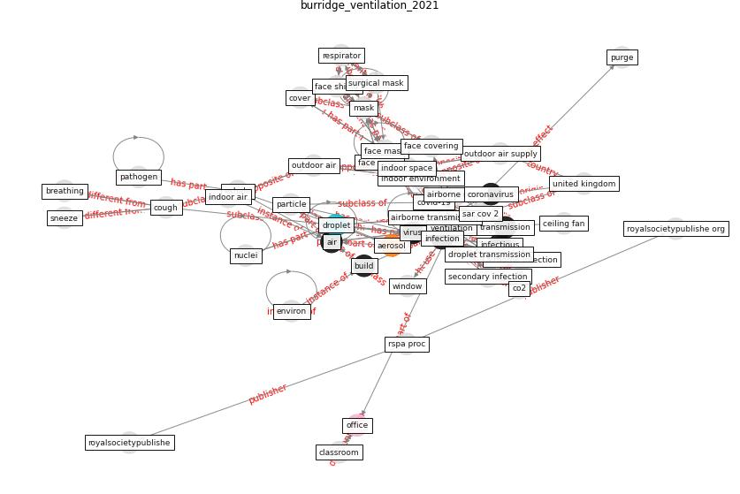

# Article: The ventilation of buildings and other mitigating measures for COVID-19: a focus on wintertime (burridge_ventilation_2021)

* Source: [10.1098/rspa.2020.0855](https://doi.org/10.1098/rspa.2020.0855)
* Year: 2021
* Cluster: [air-uv](cluster_2)

## Keywords

 * [aerosol](keyword_aerosol), [air](keyword_air), [air filter](keyword_air_filter), air supply, [airborne](keyword_airborne), [airborne infection](keyword_airborne_infection), airborne route, airborne transmission, asymptomatic, boerstra a, bourouiba, breathing, breathing zone, [build](keyword_build), buonanno, ceiling fan, classroom, [clean](keyword_clean), clean air, cloud, co2, [coronavirus](keyword_coronavirus), [corridor](keyword_corridor), cough, cover, covering, [covid 19 pandemic](keyword_covid_19_pandemic), [covid-19](keyword_covid-19), deactivate, [desk](keyword_desk), dilution, disperse, [droplet](keyword_droplet), droplet route, droplet transmission, exhalation, exhale, face cover, face covering, [face mask](keyword_face_mask), face shield, fan, [filter](keyword_filter), fluid, [hospital](keyword_hospital), houston, [indoor](keyword_indoor), indoor air, [indoor environment](keyword_indoor_environment), indoor space, [infection](keyword_infection), infectious, inhale, [mask](keyword_mask), mech j, [meta analysis](keyword_meta_analysis), milton, mix, mouth, nuclei, [office](keyword_office), outdoor air, outdoor air supply, ozone, [pandemic](keyword_pandemic), [particle](keyword_particle), [pathogen](keyword_pathogen), philadelphia, purge, respirator, [risk](keyword_risk), royal society, royalsocietypublishe, royalsocietypublishe org, rspa, rspa proc, rudnick milton, [sar cov 2](keyword_sar_cov_2), secondary infection, sneeze, speech droplet, surgical mask, [switzerland](keyword_switzerland), systematic review, [temperature](keyword_temperature), [transmission](keyword_transmission), [united kingdom](keyword_united_kingdom), university of pennsylvania, [uv](keyword_uv), ventilate, [ventilation](keyword_ventilation), ventilation provision, ventilation rate, [ventilation system](keyword_ventilation_system), [viral](keyword_viral), [virus](keyword_virus), [well](keyword_well), [window](keyword_window), [winter](keyword_winter), [workstation](keyword_workstation)

## Concepts

 

## Neighbours

### Closest articles

* The efficacy of social distance and ventilation effectiveness in preventing COVID-19 transmission - [LINK](article_sun_efficacy_2020)
* Environmental factors involved in SARS-CoV-2 transmission: effect and role of indoor environmental quality in the strategy for COVID-19 infection control - [LINK](article_azuma_environmental_2020)
* How can airborne transmission of COVID-19 indoors be minimised? - [LINK](article_morawska_how_2020)
* Methods for air cleaning and protection of building occupants from airborne pathogens - [LINK](article_bolashikov_methods_2009)
* Heating, ventilation and air-conditioning systems in the context of COVID-19 - [LINK](article_ecdc_heating_2020)
* A review of facilities management interventions to mitigate respiratory infections in existing buildings - [LINK](article_zhang_review_2022)
* 2019 Novel Coronavirus (COVID-19) Pandemic: Built Environment Considerations To Reduce Transmission - [LINK](article_dietz_2019_2020)
* Ventilation use in nonmedical settings during COVID-19: Cleaning protocol, maintenance, and recommendations - [LINK](article_nembhard_ventilation_2020)
* A critical review of heating, ventilation, and air conditioning (HVAC) systems within the context of a global SARS-CoV-2 epidemic - [LINK](article_elsaid_critical_2021)

### Closest BPs

* Installing UV in ductwork - [LINK](bp_10)
* Indoor Environmental Quality (IEQ) monitoring system - [LINK](bp_3)
* Installing high-efficiency air filters - [LINK](bp_11)
