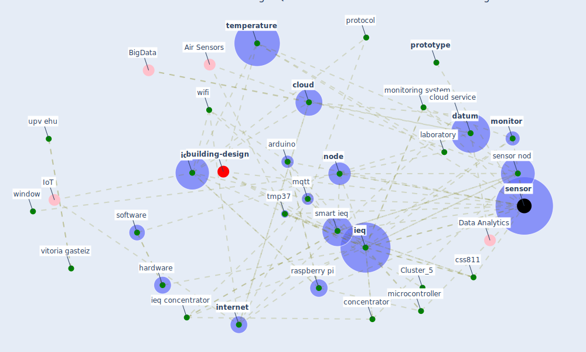

# Article: Scalable IoT Architecture for Monitoring IEQ Conditions in Public and Private Buildings (calvo_scalable_2022)

* Source: [10.3390/en15062270](https://doi.org/10.3390/en15062270)
* Year: 2022
* Cluster: [building-design](cluster_5)

## Keywords

 * adv j, air quality, [analysis](keyword_analysis), ap, [application](keyword_application), application layer, [architecture](keyword_architecture), arduino, [ashrae](keyword_ashrae), blue color, [bluetooth](keyword_bluetooth), [build](keyword_build), [building](keyword_building), candell, classroom, [cloud](keyword_cloud), cloud service, co2, coap, commune, communication, communication technology, [computer](keyword_computer), concentrator, [covid 19 pandemic](keyword_covid_19_pandemic), [covid-19](keyword_covid-19), css811, [datum](keyword_datum), [digital](keyword_digital), [door](keyword_door), eco2, edge, edge fog cloud, ehu, [energy](keyword_energy), [energy consumption](keyword_energy_consumption), exam, fog, fog layer, free, gateway, hardware, heating system, hmi, [humidity](keyword_humidity), [ieq](keyword_ieq), ieq concentrator, [internet](keyword_internet), [internet of thing](keyword_internet_of_thing), [iot](keyword_iot), iot architecture, iot system, laboratory, laboratory class, lm74, microcontroller, [monitor](keyword_monitor), monitoring system, monitoringsystem, [mqtt](keyword_mqtt), [network](keyword_network), [node](keyword_node), operation, [parameter](keyword_parameter), [poland](keyword_poland), print circuit board, private building, program, [protocol](keyword_protocol), [prototype](keyword_prototype), [public](keyword_public), raspberry pi, relative humidity, [russia](keyword_russia), [sample](keyword_sample), [sensor](keyword_sensor), sensor nod, sensor node, single board computer, [smart](keyword_smart), [smart ieq](keyword_smart_ieq), smart sensor, software, st petersburg, subscribe, [sustainability](keyword_sustainability), [system](keyword_system), tcp, [temperature](keyword_temperature), tmp37, tvoc, university of the basque country, upv ehu, [ventilation](keyword_ventilation), vitoria gasteiz, vlan, voc, [wifi](keyword_wifi), [window](keyword_window), [wireless](keyword_wireless)

## Concepts

 

## Neighbours

### Closest articles

* An Intelligent IEQ Monitoring and Feedback System: Development and Applications - [LINK](article_geng_intelligent_2021)
* Continuous IEQ monitoring system: Context and development - [LINK](article_parkinson_continuous_2019)
* A comprehensive review on indoor air quality monitoring systems for enhanced public health - [LINK](article_saini_comprehensive_2020)
* The contribution of green buildings in the fight against COVID-19 - [LINK](article_world_green_building_council_contribution_2020)
*  - [LINK](article_yakubu_aminu_dodo_green_2020)
* Emerging from Lockdown: CIBSE COVID-19 Guidance - [LINK](article_cibse_emerging_2020)
* Characterization and performance evaluation of a full-scale activated carbon-based dynamic botanical air filtration system for improving indoor air quality - [LINK](article_wang_characterization_2011)
* Indoor Air Quality: Rethinking rules of building design strategies in post-pandemic architecture - [LINK](article_megahed_indoor_2021)
* The Effect of Opening Windows on Air Change Rates in Two Homes - [LINK](article_howard-reed_effect_2002)

### Closest BPs

* Blueprint: Indoor Environmental Quality (IEQ) monitoring system - [LINK](bp_3)
* Blueprint: Air Cleaning Plants - [LINK](bp_15)
* Blueprint: Tracking and enforcing use of Personal Protective Equipment - [LINK](bp_23)
