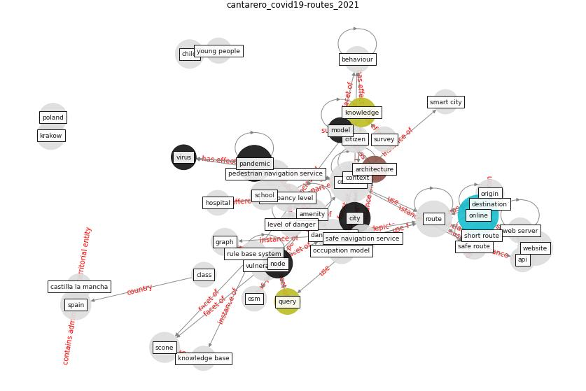

# Article: __COVID19-Routes: A Safe Pedestrian Navigation Service__ (cantarero_covid19-routes_2021)

* [10.1109/ACCESS.2021.3092970](https://doi.org/10.1109/ACCESS.2021.3092970)
* Cluster: [space-urban](cluster_13)

## Keywords

* [covid-19](keyword_covid-19), [route](keyword_route), [pandemic](keyword_pandemic), [online](keyword_online), [danger model](keyword_danger_model), [city](keyword_city), [amenity](keyword_amenity), [spain](keyword_spain), [vulnerability](keyword_vulnerability), [scone](keyword_scone), [node](keyword_node), context, [school](keyword_school), [knowledge](keyword_knowledge), [child](keyword_child)

## Keywords at large

* [biophilic design](keyword_biophilic_design), [architecture](keyword_architecture), [sustainable architecture](keyword_sustainable_architecture), [nature](keyword_nature), [design](keyword_design), [biophilic](keyword_biophilic), [environ](keyword_environ), [biophilia](keyword_biophilia), [wellbeing](keyword_wellbeing), [health](keyword_health)

## Abstract

COVID-19 has become a global pandemic during 2020 due to
its high contagiousness and the high mobility of the
world's population today. In just one year, this virus has
caused millions of infections and deaths worldwide. These
numbers will continue to grow until the population becomes
immune to the virus thanks to an effective vaccine. Until
this is possible, the only viable strategy is to try to
stop its expansion through preventive measures such as
limiting mobility, the use of masks, etc. In order to
support these measures, this article presents a service to
provide safe navigation solutions to reduce the likelihood
of infection by avoiding potential conflict areas in the
city. To identify these hotspots, a strategy that combines
a rule-based system and a common-sense knowledge base is
proposed. Through this strategy, an occupation model and a
danger model are inferred. This requires the prior capture
of knowledge about the general functioning of the city, its
inhabitants and the virus. The proposed service makes
decisions from these two models. Finally, a validation
process has been carried out through surveys to evaluate
the proposed solution. Obtained results demonstrate the
potential of the proposed solution as a tool to identify
safe routes that allow citizens to move around the city
with low exposure to COVID-19.

## Concepts

 

### References 

* [The Smart City and Covid‐19](article_webb_smart_2020)
* [Internet of things (IoT) applications to fight against
COVID-19 pandemic](article_singh_internet_2020)
* [The socio-economic implications of the coronavirus
pandemic (COVID-19): A review](article_nicola_socio-economic_2020)
* [Response to COVID-19 in Taiwan: Big Data
Analytics, New Technology, and Proactive
Testing](article_wang_response_2020)

### Cited by 

