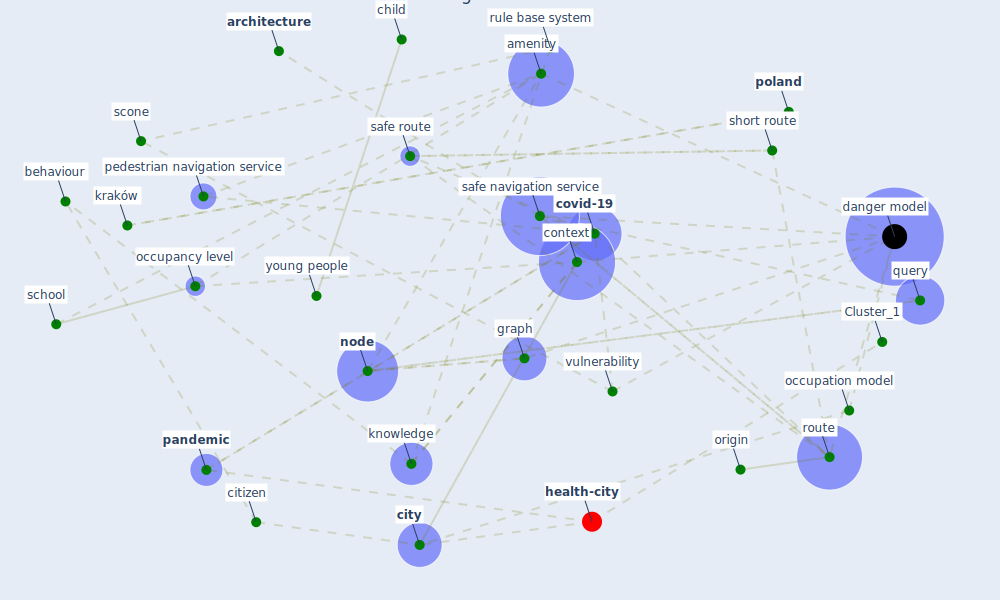

# Article: COVID19-Routes: A Safe Pedestrian Navigation Service (cantarero_covid19-routes_2021)

* Source: [10.1109/ACCESS.2021.3092970](https://doi.org/10.1109/ACCESS.2021.3092970)
* Year: 2021
* Cluster: [health-city](cluster_1)

## Keywords

 * advanced information technology, [amenity](keyword_amenity), api, [architecture](keyword_architecture), behaviour, boxplot, case 06, case 09, castilla la mancha, [child](keyword_child), [china](keyword_china), citizen, [city](keyword_city), city council, class, common sense, component, [computer](keyword_computer), computer architecture, contagion, context, [covid 19 pandemic](keyword_covid_19_pandemic), [covid-19](keyword_covid-19), covid19 route, danger, [danger model](keyword_danger_model), dangerous area, dangerous point, day, day of the week, destination, edge, evaluation, google route, graph, [hospital](keyword_hospital), hotspot, inheritance, [interface](keyword_interface), [knowledge](keyword_knowledge), knowledge base, kraków, level of danger, [model](keyword_model), [node](keyword_node), occupancy level, occupancy model, occupation, occupation level, occupation model, origin, osm, [pandemic](keyword_pandemic), [parameter](keyword_parameter), pedestrian navigation service, [poland](keyword_poland), probability, [quarantine](keyword_quarantine), query, reason, [research](keyword_research), [risk](keyword_risk), role, [route](keyword_route), rule base system, [russia](keyword_russia), safe navigation, safe navigation service, safe route, scenario, [school](keyword_school), scone, [sensor](keyword_sensor), short route, simple, [simulation](keyword_simulation), [smart city](keyword_smart_city), [south korea](keyword_south_korea), [spain](keyword_spain), st petersburg, street, summer, sunday, [survey](keyword_survey), [symptom](keyword_symptom), uclm, [united kingdom](keyword_united_kingdom), university of castilla la mancha, [usa](keyword_usa), [vaccine](keyword_vaccine), [virus](keyword_virus), [vulnerability](keyword_vulnerability), web server, weekend, [winter](keyword_winter), [work](keyword_work), [world health organization](keyword_world_health_organization), [wuhan](keyword_wuhan), young people, young person

## Concepts

 

## Neighbours

### Closest articles

* Digital Twin of COVID-19 Mass Vaccination Centers - [LINK](article_pilati_digital_2021)
* COVID-ABS: An agent-based model of COVID-19 epidemic to simulate health and economic effects of social distancing interventions - [LINK](article_silva_covid-abs_2020)
* Exploring the Non-Medical impacts of Covid-19 using Natural Language Processing - [LINK](article_agade_exploring_2020)
* Risk Diagnosis and Mitigation System of COVID-19 Using Expert System and Web Scraping - [LINK](article_mufid_risk_2020)
* EXPOSED: An occupant exposure model for confined spaces to retrofit crowd models during a pandemic - [LINK](article_ronchi_exposed_2020)
* Building occupancy estimation with people flow modeling in AnyLogic - [LINK](article_li_building_2016)
* Construction of a Linked Data Set of COVID-19 Knowledge Graphs: Development and Applications - [LINK](article_wang_construction_2022)
* Understanding the role of urban design in disease spreading - [LINK](article_brizuela_understanding_2019)
* Attitudes towards outdoor and neighbour noise during the COVID-19 lockdown: A case study in London - [LINK](article_lee_attitudes_2021)

### Closest BPs

* Blueprint: Resilience in staffing and skills training - [LINK](bp_12)
* Blueprint: Installing high-efficiency air filters - [LINK](bp_11)
* Blueprint: Air Cleaning Plants - [LINK](bp_15)
