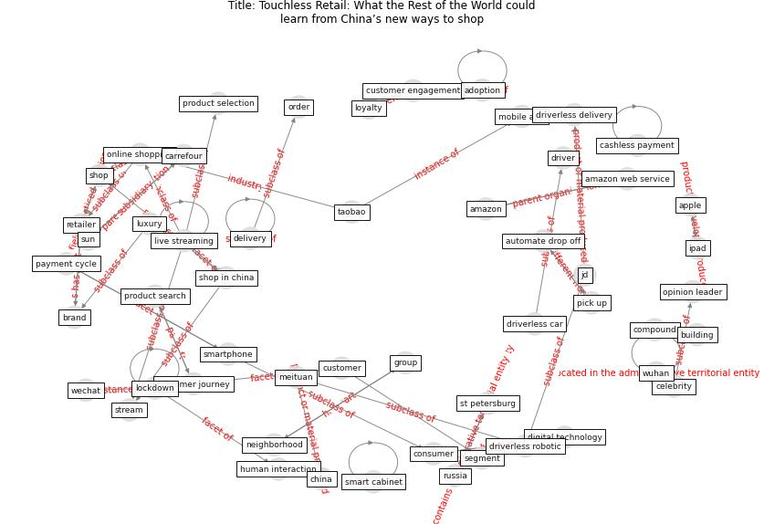

# Article: Touchless Retail: What the Rest of the World couldlearn from China’s new ways to shop (capgemini_touchless_2020)

* [https://www.capgemini.com/se-en/2020/04/touchless-retail-what-the-rest-of-the-world-could-learn-from-chinas-new-ways-to-shop/](https://www.capgemini.com/se-en/2020/04/touchless-retail-what-the-rest-of-the-world-could-learn-from-chinas-new-ways-to-shop/)
* Year: 2020
* Cluster: [building-space](cluster_9)

## Keywords

 * adoption, amazon, amazon web service, apple, automate drop off, automate vehicle, automation, banknote, [brand](keyword_brand), broadcast, [building](keyword_building), [business](keyword_business), business model, buy decision, buying habit, cabinet, carrefour, cashless payment, celebrity, [china](keyword_china), cloud provider, community base wechat, compound, [consumer](keyword_consumer), conversion, [customer](keyword_customer), customer engagement, [customer journey](keyword_customer_journey), customer service, deliveroo, [delivery](keyword_delivery), delivery agent, [digital technology](keyword_digital_technology), driver, driverless car, driverless delivery, driverless robotic, facebook messenger, flash deal, gamification, group, group buying, haidilao, handover, [hospital](keyword_hospital), hotpot, human interaction, [infection](keyword_infection), ipad, jd, [live streaming](keyword_live_streaming), live video, [lockdown](keyword_lockdown), [logistic](keyword_logistic), loyalty, luxury, meituan, meituan contactless service, mobile app, [neighborhood](keyword_neighborhood), online ordering, [online shopping](keyword_online_shopping), opinion leader, order, payment, payment cycle, pick up, pick up station, picking system, product search, product search and evaluation, product selection, refrigerate, [retail](keyword_retail), [retailer](keyword_retailer), [robotic](keyword_robotic), [russia](keyword_russia), segment, self service collection cabinet, selfservice station, serve their customer, shan liu, shop, shop in china, smart cabinet, smart pick up, smart pick up cabinet, smartphone, st petersburg, stream, sun, taobao, uber, uberpay, warehouse automation, wechat, wechat group, [wuhan](keyword_wuhan), yinman, yongliang yang

## Concepts

 

## Neighbours

### Closest articles

* Retail Signage During the COVID-19 Pandemic - [LINK](article_mcneish_retail_2020)
* How COVID-19 Could Accelerate the Adoption of New Retail Technologies and Enhance the (E-)Servicescape - [LINK](article_willems_how_2021)
* <scp>COVID</scp>             ‐19: Small and medium enterprises challenges and responses with creativity, innovation, and entrepreneurship - [LINK](article_thukral_covid19_2021)
* Startups in times of crisis – A rapid response to the COVID-19 pandemic - [LINK](article_kuckertz_startups_2020)
* Organizations’ Management of the COVID-19 Pandemic: A Scoping Review of Business Articles - [LINK](article_boiral_organizations_2021)
* Challenges of data sharing in European Covid-19 projects: A learning opportunity for advancing pandemic preparedness and response - [LINK](article_tacconelli_challenges_2022)
* 2020 Data Protection Report - [LINK](article_council_of_europe_2020_2020)
* A study on office workplace modification during the COVID-19 pandemic in The Netherlands - [LINK](article_hou_study_2021)
* It’s time to reimagine where and how work will get done (PwC’s US Remote Work Survey) - [LINK](article_pricewaterhousecoopers_its_2021)
* Building occupancy estimation with people flow modeling in AnyLogic - [LINK](article_li_building_2016)

### Closest BPs

* Smart Locker System - [LINK](bp_1)
* One-way mobility circulation - [LINK](bp_4)
* Access limitation - [LINK](bp_7)
