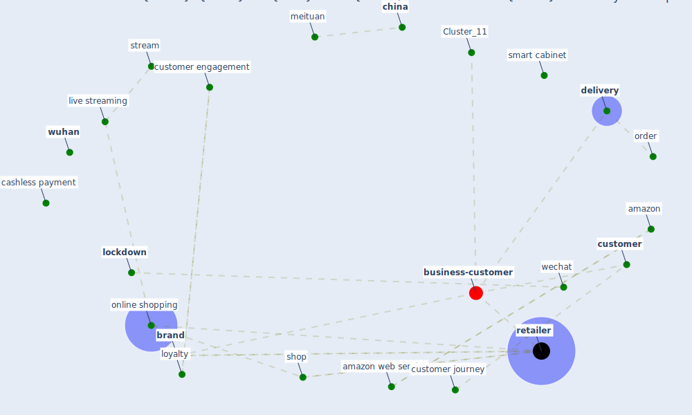

# Article: Touchless Retail: What the Rest of the World could learn from China’s new ways to shop (capgemini_touchless_2020)

* [https://www.capgemini.com/se-en/2020/04/touchless-retail-what-the-rest-of-the-world-could-learn-from-chinas-new-ways-to-shop/](https://www.capgemini.com/se-en/2020/04/touchless-retail-what-the-rest-of-the-world-could-learn-from-chinas-new-ways-to-shop/)
* Year: 2020
* Cluster: [construction-pandemic](cluster_1)

## Keywords

 * adoption, amazon, amazon web service, apple, auto sector, automate drop off, automate vehicle, automation, banknote, brand, broadcast, [building](keyword_building), [business](keyword_business), business model, buy decision, buying habit, cabinet, carrefour, cashless payment, celebrity, [china](keyword_china), cloud provider, community base wechat, compound, conversion, [customer](keyword_customer), customer engagement, [customer journey](keyword_customer_journey), customer service, deliveroo, [delivery](keyword_delivery), delivery agent, driver, driverless car, driverless delivery, driverless robotic, e commerce, end toend, facebook messenger, flash deal, gamification, group, group buying, haidilao, handover, [hospital](keyword_hospital), hotpot, human interaction, ipad, jd, [live streaming](keyword_live_streaming), live video, [lockdown](keyword_lockdown), [logistic](keyword_logistic), loyalty, luxury, meituan, meituan contactless service, mobile app, [neighborhood](keyword_neighborhood), online ordering, online shopping, opinion leader, order, payment, payment cycle, pick up, pick up station, picking system, product search, product search and evaluation, product selection, refrigerate, retail, retailer, [robotic](keyword_robotic), [russia](keyword_russia), segment, self service collection cabinet, selfservice station, serve their customer, shan liu, [shop](keyword_shop), shop in china, smart cabinet, smart pick up, smart pick up cabinet, smartphone, st petersburg, stream, sun, taobao, uber, uberpay, warehouse automation, wechat, wechat group, [wuhan](keyword_wuhan), yinman, yongliang yang

## Concepts

 

## Neighbours

### Closest articles

* Retail Signage During the COVID-19 Pandemic - [LINK](article_mcneish_retail_2020)
* How COVID-19 Could Accelerate the Adoption of New Retail Technologies and Enhance the (E-)Servicescape - [LINK](article_willems_how_2021)
* Startups in times of crisis – A rapid response to the COVID-19 pandemic - [LINK](article_kuckertz_startups_2020)
* <scp>COVID</scp>             ‐19: Small and medium enterprises challenges and responses with creativity, innovation, and entrepreneurship - [LINK](article_thukral_covid19_2021)
* Strengthening resilience: a priority shared by Health 2020 and - [LINK](article_who_strengthening_2017)
* Responsible Transport: A post-COVID agenda for transport policy and practice - [LINK](article_budd_responsible_2020)
* Mobility Behaviour in View of the Impact of the COVID-19 Pandemic—Public Transport Users in Gdansk Case Study - [LINK](article_przybylowski_mobility_2021)
*  - [LINK](article_yakubu_aminu_dodo_green_2020)
* How COVID-19 Redefines the Concept of Sustainability - [LINK](article_hakovirta_how_2020)

### Closest BPs

* Blueprint: Smart Locker System - [LINK](bp_1)
* Blueprint: Mental health – Belong: Do something with someone - [LINK](bp_19)
* Blueprint: Mental health – Act: Do something - [LINK](bp_18)
