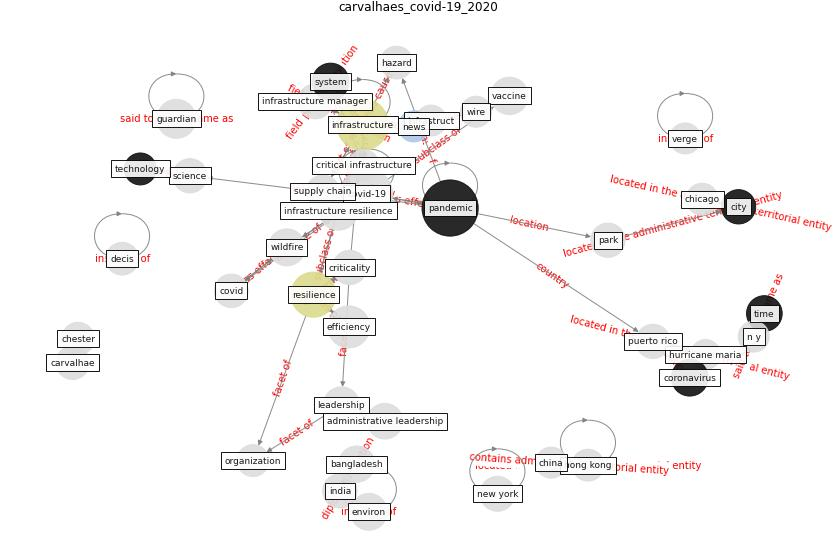

# Article: COVID-19 as a Harbinger of TransformingInfrastructure Resilience (carvalhaes_covid-19_2020)

* [https://www.frontiersin.org/articles/10.3389/fbuil.2020.00148](https://www.frontiersin.org/articles/10.3389/fbuil.2020.00148)
* Year: 2020
* Cluster: [construction-resilience](cluster_5)

## Keywords

 * 360 chester, adaptation, administrative leadership, agility, anthropocene, aust, aust j, bangladesh, bigg, black, carvalhae, [cdc](keyword_cdc), chester, chicago, [china](keyword_china), [city](keyword_city), [climate change](keyword_climate_change), cool center, [coronavirus](keyword_coronavirus), [covid-19](keyword_covid-19), [critical infrastructure](keyword_critical_infrastructure), critical service, critical system, criticality, cyber physical system, cybersecurity, dakos, decis, dietz, digital divide, [disease](keyword_disease), distribution, [efficiency](keyword_efficiency), elem, enable leadership, engineer, [engineering](keyword_engineering), essential product, externality, flexibility, function, future, guardian, hazard, [hong kong](keyword_hong_kong), hurricane maria, [india](keyword_india), [industry](keyword_industry), [influenza](keyword_influenza), infrastruct, [infrastructure](keyword_infrastructure), infrastructure manager, infrastructure resilience, institution, jones, kelley, knowledge system, kotzanikolaou, leadership, management, markolf, [month](keyword_month), n y, [new york](keyword_new_york), [news](keyword_news), non essential, [npr](keyword_npr), npr org, organization, other respir, [pandemic](keyword_pandemic), park, physical system, process, puerto rico, radiation oncology, redundancy, reshape city street, [resilience](keyword_resilience), roble, rosa, russia, science, service, smithsonian, software, st petersburg, [supply chain](keyword_supply_chain), [system](keyword_system), [technology](keyword_technology), [time](keyword_time), uncertainty, [united states](keyword_united_states), [vaccine](keyword_vaccine), verge, [washington dc](keyword_washington_dc), washington post, wildfire, wire, year

## Concepts

 

## Neighbours

### Closest articles

* Preparing critical infrastructure for the future: Lessons learnt from the Covid-19 pandemic - [LINK](article_tomalska_preparing_2022)
* DfMA for rapid adaptive resilience and flexible infrastructure - [LINK](article_mott_macdonald_dfma_2020)
* COVID-19 and a new resilient infrastructure landscape - [LINK](article_oecd_covid-19_2021)
* Guidelines for resilience systems analysis - [LINK](article_oecd_guidelines_2014)
* Strengthening resilience: a priority shared by Health 2020 and - [LINK](article_who_strengthening_2017)
* A review of definitions and measures of system resilience - [LINK](article_hosseini_review_2016)
* A Continuously Active Antimicrobial Coating effective against Human Coronavirus 229E - [LINK](article_ikner_continuously_2020)
* Understanding the role of urban design in disease spreading - [LINK](article_brizuela_understanding_2019)
* A Surface Coating that Rapidly Inactivates SARS-CoV-2 - [LINK](article_behzadinasab_surface_2020)

### Closest BPs

* Blueprint: Mental health – Commit: Do something meaningfull - [LINK](bp_20)
* Blueprint: Mental health – Belong: Do something with someone - [LINK](bp_19)
* Blueprint: Mental health – Act: Do something - [LINK](bp_18)
