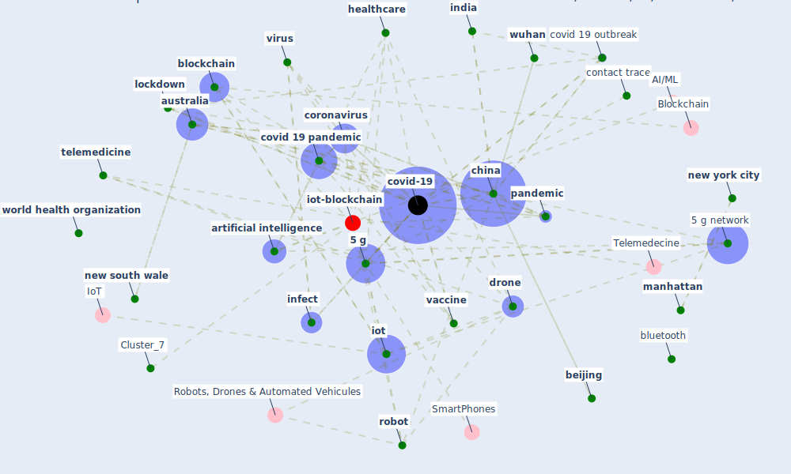

# Article: A Comprehensive Review of the COVID-19 Pandemic and the Role of IoT, Drones, AI, Blockchain, and 5G in Managing its Impact (chamola_comprehensive_2020)

* Source: [10.1109/ACCESS.2020.2992341](https://doi.org/10.1109/ACCESS.2020.2992341)
* Year: 2020
* Cluster: [iot-blockchain](cluster_7)

## Keywords

 * 2008 summer olympic, [5 g](keyword_5_g), [5 g network](keyword_5_g_network), [algorithm](keyword_algorithm), antibodie, antigen, apple, [application](keyword_application), [artificial intelligence](keyword_artificial_intelligence), [australia](keyword_australia), [beijing](keyword_beijing), [blockchain](keyword_blockchain), [blockchain technology](keyword_blockchain_technology), [bluetooth](keyword_bluetooth), [canada](keyword_canada), [cdc](keyword_cdc), cell, cepi, cern, chamola, [china](keyword_china), comprehensive review, comprehensive review of the covid 19 pandemic, contact trace, contact trace app, [coronavirus](keyword_coronavirus), coronavirus lockdown, cough, [country](keyword_country), covid 19 outbreak, [covid 19 pandemic](keyword_covid_19_pandemic), [covid-19](keyword_covid-19), current health crisis, [deep learning](keyword_deep_learning), delhi, [device](keyword_device), [diagnosis](keyword_diagnosis), [disease](keyword_disease), [drone](keyword_drone), [drug](keyword_drug), emerge technology, [genome](keyword_genome), [government](keyword_government), [gps](keyword_gps), guangzhou, [health](keyword_health), [healthcare](keyword_healthcare), healthcare worker, [hospital](keyword_hospital), [hubei](keyword_hubei), iata, impact management, [india](keyword_india), [infect](keyword_infect), [infection](keyword_infection), [influenza](keyword_influenza), iomt, [iot](keyword_iot), israel, [lockdown](keyword_lockdown), [machine learning](keyword_machine_learning), [manhattan](keyword_manhattan), [model](keyword_model), mumbai, [new south wale](keyword_new_south_wale), [new york city](keyword_new_york_city), [node](keyword_node), [organization](keyword_organization), [outbreak](keyword_outbreak), [pandemic](keyword_pandemic), [privacy](keyword_privacy), republic of korea, risk prediction, [robot](keyword_robot), [sar cov 2](keyword_sar_cov_2), [shanghai](keyword_shanghai), [south korea](keyword_south_korea), [spread](keyword_spread), [supply chain](keyword_supply_chain), [switzerland](keyword_switzerland), [symptom](keyword_symptom), [technology](keyword_technology), [telemedicine](keyword_telemedicine), [test](keyword_test), [tourism](keyword_tourism), [treatment](keyword_treatment), [united kingdom](keyword_united_kingdom), [united nations](keyword_united_nations), [usa](keyword_usa), v v, [vaccine](keyword_vaccine), victoria, [virus](keyword_virus), voice detection, [wearable](keyword_wearable), wearable device, who, [world health organization](keyword_world_health_organization), [wuhan](keyword_wuhan), xenex

## Concepts

 

## Neighbours

### Closest articles

* Leveraging Digital Transformation Technologies to Tackle COVID-19: Proposing a Privacy-First Holistic Framework - [LINK](article_arpaci_leveraging_2021)
* Emerging Technologies to Combat the COVID-19 Pandemic - [LINK](article_vaishya_emerging_2020)
* Digital technology and COVID-19 - [LINK](article_ting_digital_2020)
* The role of 5G for digital healthcare against COVID-19 pandemic: Opportunities and challenges - [LINK](article_siriwardhana_role_2021)
* Health Information Exchange with Blockchain amid Covid-19-like Pandemics - [LINK](article_christodoulou_health_2020)
* Exploring the Potential of Artificial Intelligence and Machine Learning to Combat COVID-19 and Existing Opportunities for LMIC: A Scoping Review - [LINK](article_naseem_exploring_2020)
* Pandemic Analytics: How Countries are Leveraging Big Data Analytics and Artificial Intelligence to Fight COVID-19? - [LINK](article_mehta_pandemic_2021)
* Mobile Technology Solution for COVID-19: Surveillance and Prevention - [LINK](article_raza_mobile_2021)
* Blockchain technology and its applications to combat COVID-19 pandemic - [LINK](article_sharma_blockchain_2022)
* How Can Blockchain Help People in the Event of Pandemics Such as the COVID-19? - [LINK](article_chang_how_2020)

### Closest BPs

* Blueprint: Resilience in staffing and skills training - [LINK](bp_12)
* Blueprint: Negative pressure rooms - [LINK](bp_13)
* Blueprint: Installing UV in ductwork - [LINK](bp_10)
