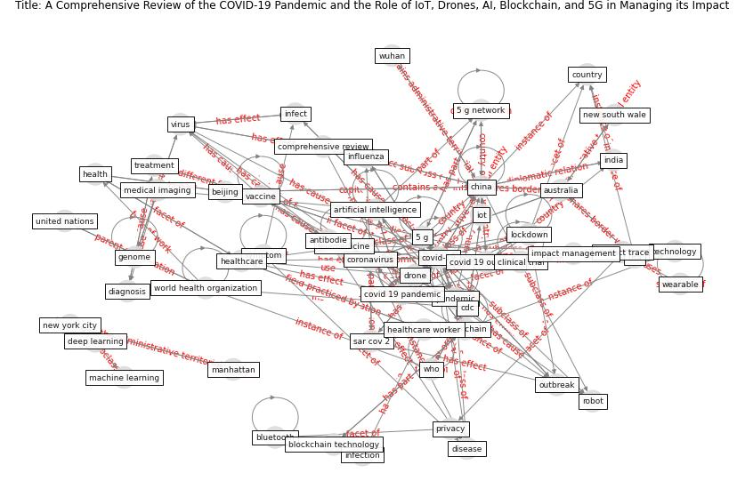

# Article: __A Comprehensive Review of the COVID-19 Pandemic and the Role of IoT, Drones, AI, Blockchain, and 5G in Managing its Impact__ (chamola_comprehensive_2020)

* [10.1109/ACCESS.2020.2992341](https://doi.org/10.1109/ACCESS.2020.2992341)
* Cluster: [blockchain-ai](cluster_11)

## Keywords

* [covid-19](keyword_covid-19), [covid 19 pandemic](keyword_covid_19_pandemic), [blockchain](keyword_blockchain), [china](keyword_china), [vaccine](keyword_vaccine), [coronavirus](keyword_coronavirus), [india](keyword_india), [pandemic](keyword_pandemic), [virus](keyword_virus), [covid 19 outbreak](keyword_covid_19_outbreak), [5 g](keyword_5_g), [drone](keyword_drone), [new south wale](keyword_new_south_wale), [lockdown](keyword_lockdown), [artificial intelligence](keyword_artificial_intelligence)

## Keywords at large

* [covid-19](keyword_covid-19), [covid 19 pandemic](keyword_covid_19_pandemic), [china](keyword_china), [blockchain](keyword_blockchain), [vaccine](keyword_vaccine), [pandemic](keyword_pandemic), [coronavirus](keyword_coronavirus), [india](keyword_india), [virus](keyword_virus), [covid 19 outbreak](keyword_covid_19_outbreak)

## Abstract

The unprecedented outbreak of the 2019 novel coronavirus,
termed as COVID-19 by the World Health Organization (WHO),
has placed numerous governments around the world in a
precarious position. The impact of the COVID-19 outbreak,
earlier witnessed by the citizens of China alone, has now
become a matter of grave concern for virtually every
country in the world. The scarcity of resources to endure
the COVID-19 outbreak combined with the fear of
overburdened healthcare systems has forced a majority of
these countries into a state of partial or complete
lockdown. The number of laboratory-confirmed coronavirus
cases has been increasing at an alarming rate throughout
the world, with reportedly more than 3 million confirmed
cases as of 30 April 2020. Adding to these woes, numerous
false reports, misinformation, and unsolicited fears in
regards to coronavirus, are being circulated regularly
since the outbreak of the COVID-19. In response to such
acts, we draw on various reliable sources to present a
detailed review of all the major aspects associated with
the COVID-19 pandemic. In addition to the direct health
implications associated with the outbreak of COVID-19, this
study highlights its impact on the global economy. In
drawing things to a close, we explore the use of
technologies such as the Internet of Things (IoT), Unmanned
Aerial Vehicles (UAVs), blockchain, Artificial Intelligence
(AI), and 5G, among others, to help mitigate the impact of
COVID-19 outbreak.

## Concepts

 

### Closest articles 

* [Emerging Technologies to Combat the COVID-19 Pandemic](article_vaishya_emerging_2020)
* [Internet of things (IoT) applications to fight against COVID-19 pandemic](article_singh_internet_2020)
* [Leveraging Digital Transformation Technologies to Tackle COVID-19: Proposing a Privacy-First Holistic Framework](article_arpaci_leveraging_2021)
* [The role of 5G for digital healthcare against COVID-19 pandemic: Opportunities and challenges](article_siriwardhana_role_2021)
* [Significant applications of virtual reality for COVID-19 pandemic](article_singh_significant_2020)
* [Mobile Technology Solution for COVID-19: Surveillance and Prevention](article_raza_mobile_2021)
* [10 tech trends getting us through the COVID-19
pandemic](article_yan_10_2020)
* [Drones. Disinfecting robots. Supercomputers. The
coronavirus outbreak is a test for China's tech industry
\textbar CNN Business](article_wang_drones_2020)
* [2020 Data Protection Report](article_council_of_europe_2020_2020)
* [Challenges of data sharing in European Covid-19 projects: A learning opportunity for advancing pandemic preparedness and response](article_tacconelli_challenges_2022)

### References 

* [Combating COVID-19—The role of robotics in managing
public health and infectious diseases](article_yang_combating_2020)
* [Digital technology and COVID-19](article_ting_digital_2020)

### Cited by 

* [Future (post-COVID) digital, smart and sustainable
cities in the wake of 6G: Digital twins, immersive
realities and new urban economies](article_allam_future_2021)
* [Leveraging Digital Transformation Technologies to
Tackle COVID-19: Proposing a Privacy-First
Holistic Framework](article_arpaci_leveraging_2021)
* [How the 5G Enabled the COVID-19 Pandemic
Prevention and Control: Materiality, Affordance,
and (De-)Spatialization](article_li_how_2022)
* [Contributions of Smart City Solutions and
Technologies to Resilience against the COVID-19
Pandemic: A Literature Review](article_sharifi_contributions_2021)
* [Impact of COVID-19 on IoT Adoption in Healthcare,
Smart Homes, Smart Buildings, Smart Cities,
Transportation and Industrial IoT](article_umair_impact_2021)
