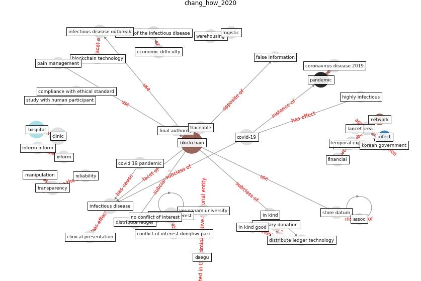

# Article: How Can Blockchain Help People in the Event of Pandemics Such as the COVID-19? (chang_how_2020)

* Source: [10.1007/s10916-020-01577-8](https://doi.org/10.1007/s10916-020-01577-8)
* Year: 2020
* Cluster: [datum-ai](cluster_1)

## Keywords

 * alter datum, alter datum after hack, [anxiety](keyword_anxiety), assoc, [blockchain](keyword_blockchain), [blockchain technology](keyword_blockchain_technology), [china](keyword_china), [clinic](keyword_clinic), clinical presentation, compliance with ethical standard, [conflict of interest](keyword_conflict_of_interest), conflict of interest declaration, conflict of interest donghwi park, corruption, corruption regard donation, [covid 19 pandemic](keyword_covid_19_pandemic), [covid-19](keyword_covid-19), current system, daegu, daegu republic of korea, [datum](keyword_datum), datum store, diagnostic information, distribute ledger, distribute ledger technology, distribution, donate money, donation, dong gu, economic difficulty, ethical standard, expense, false information, false information regard infectious disease, fatality rate, final authority, financial, hack, hack attack, have cause many death worldwide, highly infectious, [hospital](keyword_hospital), identity, identity of the subscriber, in kind, in kind good, [infect](keyword_infect), [infectious disease](keyword_infectious_disease), infectious disease outbreak, infectious disease report system, inform, inform inform, insurance, [korea](keyword_korea), korean government, kucharski aj, [logistic](keyword_logistic), manipulation, mathematical, mathematical modelling, medical information, melanet, [model](keyword_model), model study, monetary donation, money, national research foundation, national research foundation of korea, [network](keyword_network), no conflict of interest, novel infectious disease, omission, omission of report, open, pain management, [pandemic](keyword_pandemic), passive reporting, peer to peer, [psychological](keyword_psychological), psychological anxiety, reliability, severe acute respiratory syndrome, spread of the infectious disease, store datum, [study](keyword_study), study with human participant, temporal expense, traceable, track, transparency, transparent, ulsan, warehousing, [wuhan](keyword_wuhan), yeungnam university

## Concepts

 

## Neighbours

### Closest articles

* Blockchain technology and its applications to combat COVID-19 pandemic - [LINK](article_sharma_blockchain_2022)
* Health Information Exchange with Blockchain amid Covid-19-like Pandemics - [LINK](article_christodoulou_health_2020)
* Leveraging Digital Transformation Technologies to Tackle COVID-19: Proposing a Privacy-First Holistic Framework - [LINK](article_arpaci_leveraging_2021)
* A Comprehensive Review of the COVID-19 Pandemic and the Role of IoT, Drones, AI, Blockchain, and 5G in Managing its Impact - [LINK](article_chamola_comprehensive_2020)
* Digital technology and COVID-19 - [LINK](article_ting_digital_2020)
* Impact of COVID-19 on IoT Adoption in Healthcare, Smart Homes, Smart Buildings, Smart Cities, Transportation and Industrial IoT - [LINK](article_umair_impact_2021)
* Emerging Technologies to Combat the COVID-19 Pandemic - [LINK](article_vaishya_emerging_2020)
* How the 5G Enabled the COVID-19 Pandemic Prevention and Control: Materiality, Affordance, and (De-)Spatialization - [LINK](article_li_how_2022)
* Design COVID-19 Ontology: A Healthcare and Safety Perspective - [LINK](article_aloulou_design_2022)
* The role of 5G for digital healthcare against COVID-19 pandemic: Opportunities and challenges - [LINK](article_siriwardhana_role_2021)

### Closest BPs

* Monitoring of wastewater [CID] - [LINK](bp_21)
* Resilience in staffing and skills training - [LINK](bp_12)
* Public places as information points - [LINK](bp_8)
