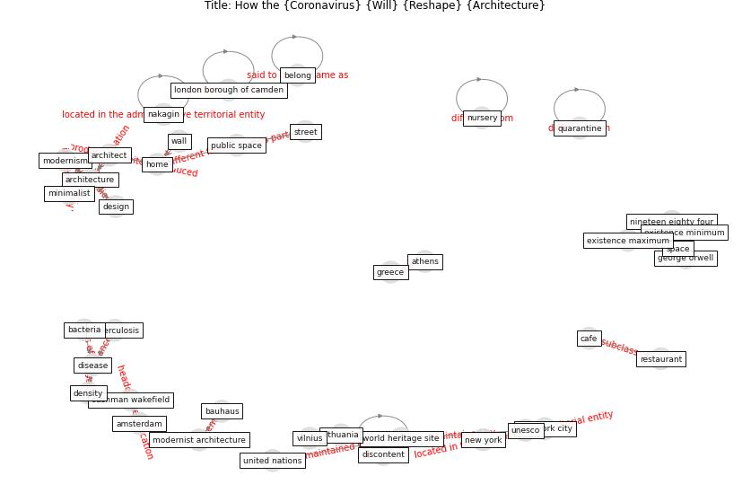

# Article: How the Coronavirus Will Reshape Architecture (chayka_how_2020)

* [https://www.newyorker.com/culture/dept-of-design/how-the-coronavirus-will-reshape-architecture](https://www.newyorker.com/culture/dept-of-design/how-the-coronavirus-will-reshape-architecture)
* Year: 2020
* Cluster: [building-space](cluster_1)

## Keywords

 * aesthetic, american medicine, amsterdam, [architect](keyword_architect), [architecture](keyword_architecture), athens, [bacteria](keyword_bacteria), bauhaus, beatriz colomina, bed, [beijing](keyword_beijing), belong, brooklyn, bruce mosler, [build](keyword_build), café, car, [coronavirus](keyword_coronavirus), cushman wakefield, d I, density, [design](keyword_design), discontent, [disease](keyword_disease), domestic space, dutch, emma roulette c, england, existence maximum, existence minimum, exterior landscape, fear, fraught, george orwell, glove, greece, hand, [home](keyword_home), [hospital](keyword_hospital), hospital architecture, [house](keyword_house), kitchen, kofi annan, kyle chayka, laptop, [le corbusier](keyword_le_corbusier), limit, lithuania, [london](keyword_london), london borough of camden, ludwig mie van der rohe, [manhattan](keyword_manhattan), marcel breuer, [mask](keyword_mask), minimalist, modernism, modernist architecture, nakagin, [new york](keyword_new_york), [new york city](keyword_new_york_city), new yorker, nineteen eighty four, nursery, [office](keyword_office), [pandemic](keyword_pandemic), physical one, [physical space](keyword_physical_space), poker, pool noodle hat, private space, protest, public realm, [public space](keyword_public_space), purification, quarantine, rebirth, recline, restaurant, rhinebeck, sanatorium, sidewalk, so il, [social distancing](keyword_social_distancing), [space](keyword_space), street, the right stuff, thomas mann, tristan, trump tower, [tuberculosis](keyword_tuberculosis), u s, uarantine, [unesco](keyword_unesco), [united nations](keyword_united_nations), [urbanism](keyword_urbanism), video george floyd s death, [vilnius](keyword_vilnius), virtual wall, wall, [world heritage site](keyword_world_heritage_site)

## Concepts

 

## Neighbours

### Closest articles

* RESIDENTIAL ARCHITECTURE IN A POST-PANDEMIC WORLD: IMPLICATIONS OF COVID-19 FOR NEW CONSTRUCTION AND FOR ADAPTING HERITAGE BUILDINGS - [LINK](article_spennemann_residential_2021)
* Designing for COVID-2x: Reflecting on Future-Proofing Human Habitation for the Inevitable Next Pandemic - [LINK](article_spennemann_designing_2022)
* Adaptive Design of the Built Environment to Mitigate the Transmission Risk of COVID-19 - [LINK](article_ara_dilshad_shangi_adaptive_2020)
* How is COVID-19 Experience Transforming Sustainability Requirements of Residential Buildings? A Review - [LINK](article_tokazhanov_how_2020)
* How Architecture Fails in Conditions of Crisis: a Discussion on the Value of Interior Design over the COVID-19 Outbreak - [LINK](article_rassia_how_2020)
* Houses amid COVID-19: Environmental challenges and design adaptation - [LINK](article_hizra_houses_2021)
* Biophilic design in architecture and its contributions to health, well-being, and sustainability: A critical review - [LINK](article_zhong_biophilic_2022)
* Prophylactic Architecture: Formulating the Concept of Pandemic-Resilient Homes - [LINK](article_elrayies_prophylactic_2022)
* COVID-19 and Green Housing: A Review of Relevant Literature - [LINK](article_kaklauskas_covid-19_2021)

### Closest BPs

* Blueprint: Architecture design - [LINK](bp_2)
* Blueprint: Building Adaptation during a pandemic - [LINK](bp_14)
* Blueprint: Tender support at building stage - [LINK](bp_9)
