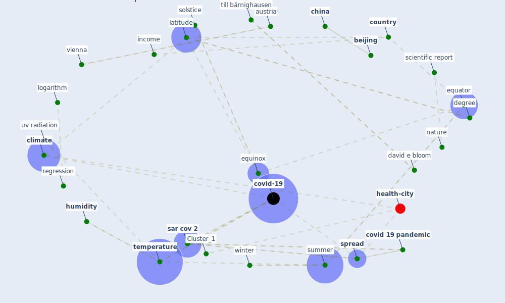

# Article: Climate and the spread of COVID-19 (chen_climate_2021)

* Source: [10.1038/s41598-021-87692-z](https://doi.org/10.1038/s41598-021-87692-z)
* Year: 2021
* Cluster: [health-city](cluster_1)

## Keywords

 * acute respiratory tract infection, alexander von humboldt foundation, alexander von humboldt professor award, [austria](keyword_austria), [beijing](keyword_beijing), case per million inhabitant, case threshold, [china](keyword_china), china japan friendship hospital, [city](keyword_city), [climate](keyword_climate), climate modeling, climatic condition, confound factor, control variable, [country](keyword_country), [covid 19 pandemic](keyword_covid_19_pandemic), [covid-19](keyword_covid-19), [datum](keyword_datum), david e bloom, degree, distance from the equator, ecological, [effect](keyword_effect), effect size, emi, [engineering](keyword_engineering), epidemic response, equator, equinox, genre, geography, hayden f wang c horby p gao g f, health expenditure, health infrastructure, health policy, heat, heteroscedasticity, [hong kong](keyword_hong_kong), [humidity](keyword_humidity), immune response, income, influenza a, klaus prettner, kwazulu natal, latitude, laxenburg, limitation, literature review, logarithm, low humidity, low temperature, main text, mibeta, multivariable regression, [nature](keyword_nature), nested model, [nih](keyword_nih), northern hemisphere, norway, old age dependency ratio, oslo, outbreak control, [pandemic](keyword_pandemic), pap, pap brooking, public health emergency, r2, radiation, regression, [sar cov 2](keyword_sar_cov_2), science fiction, sciences, scientific report, severe acute respiratory syndrome coronavirus 2, simiao chen, solstice, somkhele, [spread](keyword_spread), spread of disease, standard error, stanford university, stata, summer, supplementary material, [temperature](keyword_temperature), testing, till bärnighausen, urbanization, [uv](keyword_uv), uv radiation, [vienna](keyword_vienna), vienna university of economic and business, [viral](keyword_viral), w hayden f wang c horby p gao g f, who, [winter](keyword_winter), world, world development indicator, [world health organization](keyword_world_health_organization)

## Concepts

 

## Neighbours

### Closest articles

* Effects of temperature and humidity on the spread of COVID-19: A systematic review - [LINK](article_mecenas_effects_2020)
* COVID-19 could be a seasonal illness with higher risk in winter: Reduced humidity linked to increased COVID-19 risk - [LINK](article_university_of_sydney_covid-19_2020)
* Study of COVID-19 pandemic in London (UK) from urban context - [LINK](article_ghosh_study_2020)
* Mechanistic insights into the effect of humidity on airborne influenza virus survival, transmission and incidence - [LINK](article_marr_mechanistic_2019)
* An investigation of transmission control measures during the first 50 days of the COVID-19 epidemic in China - [LINK](article_tian_investigation_2020)
* The effect of human mobility and control measures on the COVID-19 epidemic in China - [LINK](article_kraemer_effect_2020)
* COVID-19 Higher Mortality in Chinese Regions With Chronic Exposure to Lower Air Quality - [LINK](article_pansini_covid-19_2021)
* Air pollution linked with higher COVID-19 death rates - [LINK](article_harvard_th_chan_schoold_of_public_health_air_2020)
* Open-source analytics tools for studying the COVID-19 coronavirus outbreak - [LINK](article_wu_open-source_2020)
* Coronavirus: Can artificial intelligence be smart enough to detect fake news? - [LINK](article_tong_coronavirus_2020)

### Closest BPs

* Blueprint: Resilience in staffing and skills training - [LINK](bp_12)
* Blueprint: Installing UV in ductwork - [LINK](bp_10)
* Blueprint: Negative pressure rooms - [LINK](bp_13)
