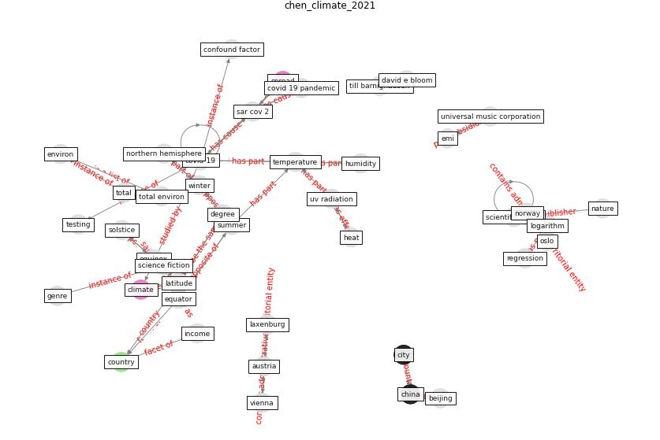

# Article: __Climate and the spread of COVID-19__ (chen_climate_2021)

* [10.1038/s41598-021-87692-z](https://doi.org/10.1038/s41598-021-87692-z)
* Cluster: [health-building](cluster_9)

## Keywords

* [covid-19](keyword_covid-19), [china](keyword_china), [temperature](keyword_temperature), [beijing](keyword_beijing), [winter](keyword_winter), [summer](keyword_summer), [latitude](keyword_latitude), [austria](keyword_austria), emi, [equinox](keyword_equinox), country, [uv radiation](keyword_uv_radiation), equator, degree, regression

## Keywords at large

* [covid-19](keyword_covid-19), [china](keyword_china), [temperature](keyword_temperature), [winter](keyword_winter), [beijing](keyword_beijing), [summer](keyword_summer), [latitude](keyword_latitude), [austria](keyword_austria), [uv radiation](keyword_uv_radiation), [equinox](keyword_equinox)

## Abstract

Abstract Visual inspection of world maps shows that
coronavirus disease 2019 (COVID-19) is less prevalent in
countries closer to the equator, where heat and humidity
tend to be higher. Scientists disagree how to interpret
this observation because the relationship between COVID-19
and climatic conditions may be confounded by many factors.
We regress the logarithm of confirmed COVID-19 cases per
million inhabitants in a country against the country’s
distance from the equator, controlling for key confounding
factors: air travel, vehicle concentration, urbanization,
COVID-19 testing intensity, cell phone usage,
income, old-age dependency ratio, and health expenditure.
A one-degree increase in absolute latitude is associated
with a 4.3\% increase in cases per million inhabitants as
of January 9, 2021 (p value \textless 0.001). Our
results imply that a country, which is located 1000 km
closer to the equator, could expect 33\% fewer cases per
million inhabitants. Since the change in Earth’s angle
towards the sun between equinox and solstice is about
23.5°, one could expect a difference in cases per million
inhabitants of 64\% between two hypothetical countries
whose climates differ to a similar extent as two adjacent
seasons. According to our results, countries are expected
to see a decline in new COVID-19 cases during summer and a
resurgence during winter. However, our results do not imply
that the disease will vanish during summer or will not
affect countries close to the equator. Rather, the higher
temperatures and more intense UV radiation in summer are
likely to support public health measures to contain
SARS-CoV-2.

## Concepts

 

### Closest articles 

* [The Socio-Spatial Determinants of COVID-19 Diffusion: The Impact of Globalisation, Settlement Characteristics and Population](article_sigler_socio-spatial_2020)
* [Study of COVID-19 pandemic in London (UK) from urban context](article_ghosh_study_2020)
* [The effect of human mobility and control measures on the COVID-19 epidemic in China](article_kraemer_effect_2020)
* [Association of built environment attributes with the spread of COVID-19 at its initial stage in China](article_li_association_2021)
* [The socio-economic determinants of COVID-19: A spatial analysis of German county level data](article_ehlert_socio-economic_2021)
* [Open-source analytics tools for studying the COVID-19 coronavirus outbreak](article_wu_open-source_2020)
* 
* [Treating two pandemics for the price of one: Chronic and infectious disease impacts of the built and natural environment](article_frank_treating_2021)
* [Infodemic and the spread of fake news in the COVID-19-era](article_orso_infodemic_2020)
* [Response to COVID-19 in Taiwan](article_wang_response_2020)

### References 

* [Far-UVC light (222 nm) efficiently and safely
inactivates airborne human coronaviruses](article_buonanno_far-uvc_2020)
* [Response to COVID-19 in Taiwan: Big Data
Analytics, New Technology, and Proactive
Testing](article_wang_response_2020)

### Cited by 

