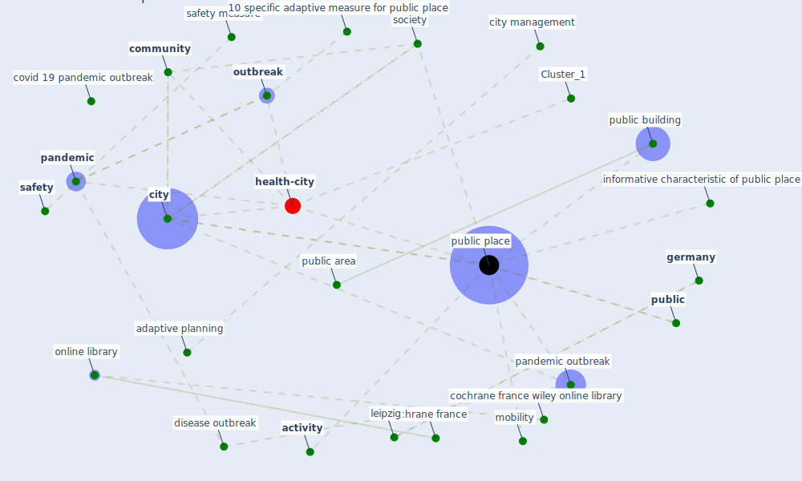

# Article: 10 Adaptive Measures for Public Places to face the COVID 19 Pandemic Outbreak (cheshmehzangi_10_2020)

* Source: [10.1111/ciso.12282](https://doi.org/10.1111/ciso.12282)
* Year: 2020
* Cluster: [health-city](cluster_1)

## Keywords

 * 10 specific adaptive measure for public place, [activity](keyword_activity), adaptive planning, alterman, augment locality, [australia](keyword_australia), bedford, bedford square press, [berlin](keyword_berlin), birkhaus verlag, checkpoint, [city](keyword_city), city management, city space, [cochrane france](keyword_cochrane_france), cochrane france wiley online library, cognitive science, [community](keyword_community), community level area, community level designate zone, cool and heating system, cool fan, covid 19 pandemic outbreak, disease outbreak, [disinfect](keyword_disinfect), elevator, emergency service, entry node, exit point, food supply, functionality, [germany](keyword_germany), good collection point, group gathering, [health and safety](keyword_health_and_safety), [healthcare](keyword_healthcare), hubs, [indoor](keyword_indoor), indoor public place, informative characteristic of public place, intermingle, leipzig, [lift](keyword_lift), long run, [management](keyword_management), [mobility](keyword_mobility), [new south wale](keyword_new_south_wale), [node](keyword_node), one way mobility circulation, [online library](keyword_online_library), [outbreak](keyword_outbreak), outdoor, outdoor public place, [pandemic](keyword_pandemic), pandemic outbreak, [people](keyword_people), [plan](keyword_plan), planning regulation, primary, primary access node, primary service, [privacy](keyword_privacy), [public](keyword_public), public area, public building, public facility, [public place](keyword_public_place), public place as informative node, public place as informative node in the city, public use, r 1988, recording opportunity, regeneration, regulation, regulatory, renewal, [resilience](keyword_resilience), safe, safeguard, [safety](keyword_safety), safety check, safety measure, secondary access point, [society](keyword_society), temperature check, temporary, temporary measure, temporary regulation, temporary urban space, this outbreak, [transportation](keyword_transportation), transportation mobility, [unesco](keyword_unesco), [united states](keyword_united_states), unoccupied place, urban regeneration, urban resilience, urban screen, visible, warm

## Concepts

 

## Neighbours

### Closest articles

* The City Under COVID‐19: Podcasting As Digital Methodology - [LINK](article_rogers_city_2020)
* Amplifying the role of knowledge translation platforms in the COVID-19 pandemic response - [LINK](article_el-jardali_amplifying_2020)
* From Viral City to Smart City: Learning from Pandemic Experiences - [LINK](article_sakellarides_viral_2020)
* Green spaces, especially forest, linked to lower SARS-CoV-2 infection rates: A one-year nationwide study - [LINK](article_jiang_green_2021)
* Urban design attributes and resilience: COVID-19 evidence from New York City - [LINK](article_yang_urban_2021)
* Association between indoor-outdoor green features and psychological health during the COVID-19 lockdown in Italy: A cross-sectional nationwide study - [LINK](article_spano_association_2021)
* COVID-19 Lockdown: Housing Built Environment’s Effects on Mental Health - [LINK](article_amerio_covid-19_2020)
* Association of built environment attributes with the spread of COVID-19 at its initial stage in China - [LINK](article_li_association_2021)
* Dangerous liaisons? Applying the social harm perspective to the social inequality, housing and health trifecta during the Covid-19 pandemic - [LINK](article_gurney_dangerous_2021)
* Eviction, Health Inequity, and the Spread of COVID-19: Housing Policy as a Primary Pandemic Mitigation Strategy - [LINK](article_benfer_eviction_2021)

### Closest BPs

* Blueprint: Resilience in staffing and skills training - [LINK](bp_12)
* Blueprint: Monitoring of wastewater - [LINK](bp_21)
* Blueprint: Installing high-efficiency air filters - [LINK](bp_11)
