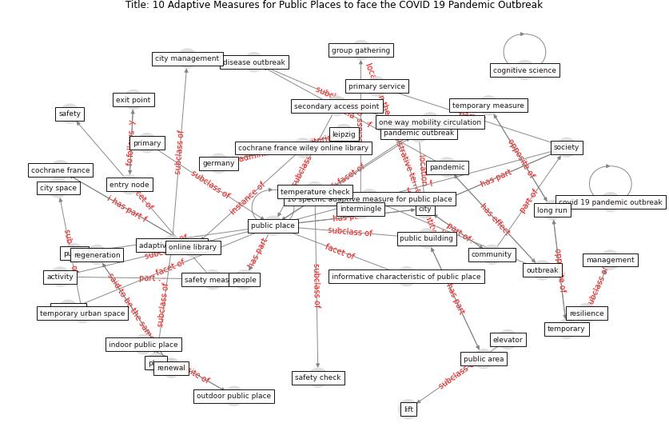

# Article: __10 Adaptive Measures for Public Places to face the COVID 19 Pandemic Outbreak__ (cheshmehzangi_10_2020)

* [10.1111/ciso.12282](https://doi.org/10.1111/ciso.12282)
* Cluster: [space-urban](cluster_13)

## Keywords

* [public place](keyword_public_place), [online library](keyword_online_library), [cochrane france](keyword_cochrane_france), [city](keyword_city), [society](keyword_society), [american anthropological association](keyword_american_anthropological_association), [cochrane france wiley online library](keyword_cochrane_france_wiley_online_library), [public building](keyword_public_building), [public](keyword_public), [germany](keyword_germany), pandemic outbreak, [node](keyword_node), [mobility](keyword_mobility), adaptive planning, social space

## Keywords at large

* [biophilic design](keyword_biophilic_design), [architecture](keyword_architecture), [sustainable architecture](keyword_sustainable_architecture), [nature](keyword_nature), [design](keyword_design), [biophilic](keyword_biophilic), [environ](keyword_environ), [biophilia](keyword_biophilia), [wellbeing](keyword_wellbeing), [health](keyword_health)

## Concepts

 

