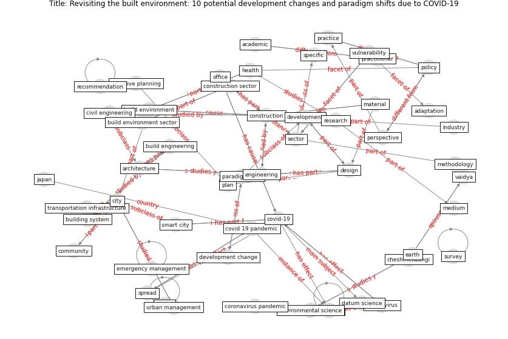

# Article: __Revisiting the built environment: 10 potential development changes and paradigm shifts due to COVID-19__ (cheshmehzangi_revisiting_2021)

* [10.1016/j.jum.2021.01.002](https://doi.org/10.1016/j.jum.2021.01.002)
* Cluster: [health-city](cluster_3)

## Keywords

[construction](keyword_construction), [pandemic](keyword_pandemic), [city](keyword_city), [engineering](keyword_engineering), [health](keyword_health), [coronavirus](keyword_coronavirus), [design](keyword_design), [policy](keyword_policy)

## Concepts

 

### References 

* [The City Under COVID‐19: Podcasting As
Digital Methodology](article_rogers_city_2020)
* [Reframe how to serve your community in the midst of a
pandemic](article_sutton_reframe_2020)

### Cited by 

