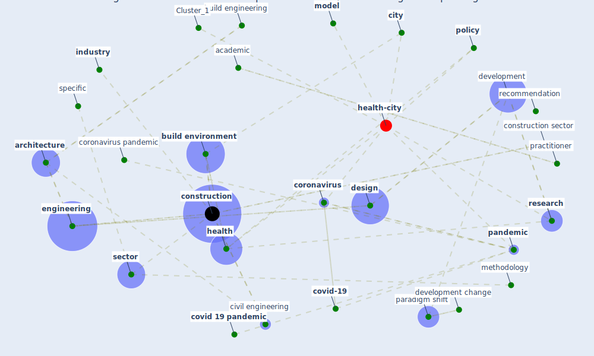

# Article: Revisiting the built environment: 10 potential development changes and paradigm shifts due to COVID-19 (cheshmehzangi_revisiting_2021)

* Source: [10.1016/j.jum.2021.01.002](https://doi.org/10.1016/j.jum.2021.01.002)
* Year: 2021
* Cluster: [construction-pandemic](cluster_1)

## Keywords

 * academic, adaptation, adaptive planning, aggarwal, [architecture](keyword_architecture), attiwill, blewitt, build engineering, [build environment](keyword_build_environment), build environment sector, building material, building system, [business](keyword_business), car use, cheshmehzangi, [china](keyword_china), [city](keyword_city), civil engineering, [climate change](keyword_climate_change), cognitive science, [community](keyword_community), [construction](keyword_construction), construction sector, context, confirmation, [coronavirus](keyword_coronavirus), coronavirus pandemic, [covid 19 pandemic](keyword_covid_19_pandemic), [covid-19](keyword_covid-19), datum science, [design](keyword_design), development, development change, disaster, document, economic challenge, emergency management, [engineering](keyword_engineering), factor, [health](keyword_health), [high](keyword_high), [hospital](keyword_hospital), identification, [industry](keyword_industry), jalosinska, [japan](keyword_japan), kopnina, lenhart, lightweight construction, literature review, m olsson, mahapatra, [malaysia](keyword_malaysia), material, [medium](keyword_medium), methodology, [model](keyword_model), nguyen, office, [pandemic](keyword_pandemic), pandemic preparedness, paper, paradigm shift, patnaik, [perspective](keyword_perspective), [plan](keyword_plan), [policy](keyword_policy), practice, practitioner, preprint paper, primary area, [public health](keyword_public_health), publisher, ramakrishnan, rawaf, recommendation, [research](keyword_research), scientific, [sector](keyword_sector), [smart city](keyword_smart_city), smith, [sound](keyword_sound), sound insulation, specific, [spread](keyword_spread), sunahara, [survey](keyword_survey), therapeutic, transportation, transportation infrastructure, [unesco](keyword_unesco), [united kingdom](keyword_united_kingdom), university of oxford, urban design, urban layout, urban management, vaidya, [vulnerability](keyword_vulnerability), [world heritage site](keyword_world_heritage_site), yamamoto

## Concepts

 

## Neighbours

### Closest articles

*  - [LINK](article_yakubu_aminu_dodo_green_2020)
* Navigating Climate Change: Rethinking the Role of Buildings - [LINK](article_cole_navigating_2020)
* Smart cities and a data-driven response to COVID-19 - [LINK](article_james_smart_2020)
* A critical analysis of the impacts of COVID-19 on the global economy and ecosystems and opportunities for circular economy strategies - [LINK](article_ibn-mohammed_critical_2021)
* Urban planning after COVID-19 - [LINK](article_rtpi_urban_2021)
* Smart cities and the pandemic: digital technologies on the urban management of Brazilian cities - [LINK](article_fariniuk_smart_2020)
* Building up an ecologically sustainable and socially desirable post-COVID-19 future - [LINK](article_duflot_building_2021)
* Proximity and post-COVID-19 urban development: Reflections from Milan, Italy - [LINK](article_tricarico_proximity_2021)
* COVID-19 risks and systemic gaps in Nigeria: resilience building lessons for pandemic and climate change management - [LINK](article_lawal_covid-19_2022)
* On the Coronavirus (COVID-19) Outbreak and the Smart City Network: Universal Data Sharing Standards Coupled with Artificial Intelligence (AI) to Benefit Urban Health Monitoring and Management - [LINK](article_allam_coronavirus_2020)

### Closest BPs

* Blueprint: Smart Locker System - [LINK](bp_1)
* Blueprint: Mental health – Belong: Do something with someone - [LINK](bp_19)
* Blueprint: Mental health – Act: Do something - [LINK](bp_18)
