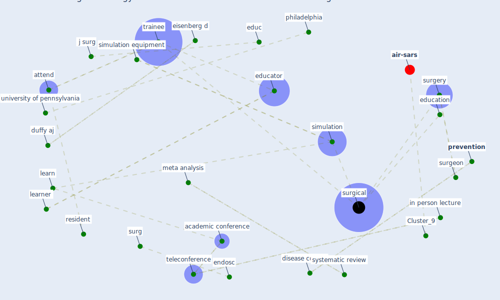

# Article: Using Technology to Maintain the Education of Residents During the COVID-19 Pandemic (chick_using_2020)

* Source: [10.1016/j.jsurg.2020.03.018](https://doi.org/10.1016/j.jsurg.2020.03.018)
* Year: 2020
* Cluster: [iot-blockchain](cluster_7)

## Keywords

 * academic conference, attend, avail, [berkeley california](keyword_berkeley_california), bmc, brunckhorst, butt k, [case](keyword_case), cholecystectomy, civil right, clinic model, [conference](keyword_conference), consult encounter, [covid-19](keyword_covid-19), dasgupta, disease control, duffy aj, educ, [education](keyword_education), [educator](keyword_educator), eisenberg d, elective operation, emergencypreparedness, endosc, endoscopic surgeon, facs org, flip classroom, gastrointestinal, hashimoto da, headmounte camera, healthcare personnel, [hospital](keyword_hospital), in person lecture, j be coll, j surg, j surg re, junior, kane ed, kemp bohan pm, kiran, knowledge acquisition, laparoscopic, [learn](keyword_learn), [learner](keyword_learner), lecture, lo ck, logghe hj, mansur a, med educ, [meta analysis](keyword_meta_analysis), [mortality](keyword_mortality), multi institutional, oelschlager, [office](keyword_office), on call, online video conference, operative experience, [participant](keyword_participant), [patient](keyword_patient), patient care, peace km, philadelphia, powerpoint, prerecord video lecture, presentation, [prevention](keyword_prevention), [resident](keyword_resident), seattle, senior, [simulation](keyword_simulation), simulation equipment, simulation laboratory, [spread](keyword_spread), surg, surgeon, [surgery](keyword_surgery), [surgical](keyword_surgical), synthesis, systematic review, teach method, technologic capability, [technology](keyword_technology), [teleconference](keyword_teleconference), [telehealth](keyword_telehealth), time course, trainee, undefine, [unesco](keyword_unesco), [united nations](keyword_united_nations), [university of california berkeley](keyword_university_of_california_berkeley), university of pennsylvania, university of utah, video lecture, video library, video portfolio, wa, white house, [world health organization](keyword_world_health_organization), [world heritage site](keyword_world_heritage_site), youtube

## Concepts

 

## Neighbours

### Closest articles

* Case Study on Finnish TVETA Resilient Model of Training During COVID-19 - [LINK](article_unesco_case_2021)
* Reframe how to serve your community in the midst of a pandemic - [LINK](article_sutton_reframe_2020)
* COVID-19 Bulletin 1: Alterations to BREEAM assessment requirements as a result of the Coronavirus pandemic – Knowledge Base - [LINK](article_breeam_covid-19_2020)
* 10 tech trends getting us through the COVID-19 pandemic - [LINK](article_yan_10_2020)
* Management of the COVID-19 pandemic: challenges, practices, and organizational support - [LINK](article_hossny_management_2022)
* Emergency Healthcare Facilities: Managing Design in a Post Covid-19 World - [LINK](article_marinelli_emergency_2020)
* A Platform for Citizen Cooperation during the COVID-19 Pandemic in RN, Brazil - [LINK](article_de_araujo_platform_2020)

### Closest BPs

* Blueprint: Resilience in staffing and skills training - [LINK](bp_12)
* Blueprint: Smart Locker System - [LINK](bp_1)
* Blueprint: Installing high-efficiency air filters - [LINK](bp_11)
