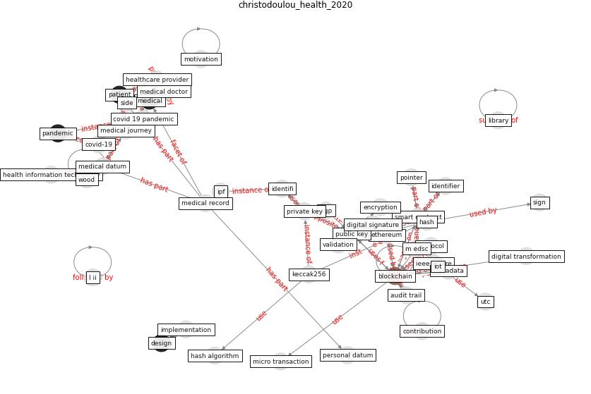

# Article: __Health Information Exchange with Blockchain amid Covid-19-like Pandemics__ (christodoulou_health_2020)

* [10.1109/DCOSS49796.2020.00071](https://doi.org/10.1109/DCOSS49796.2020.00071)
* Cluster: [blockchain-ai](cluster_11)

## Keywords

* [blockchain](keyword_blockchain), [smart contract](keyword_smart_contract), [public key](keyword_public_key), [medical datum](keyword_medical_datum), [medical record](keyword_medical_record), [metadata](keyword_metadata), [ipf](keyword_ipf), [ethereum](keyword_ethereum), [pgp](keyword_pgp), [healthcare provider](keyword_healthcare_provider), [patient](keyword_patient), [pandemic](keyword_pandemic), private key, m edsc, medical doctor

## Keywords at large

* [blockchain](keyword_blockchain), [smart contract](keyword_smart_contract), [public key](keyword_public_key), [medical datum](keyword_medical_datum), [ipf](keyword_ipf), [metadata](keyword_metadata), [medical record](keyword_medical_record), [ethereum](keyword_ethereum), [pgp](keyword_pgp), [healthcare provider](keyword_healthcare_provider)

## Concepts

 

### Closest articles 

* [How Can Blockchain Help People in the Event of Pandemics Such as the COVID-19?](article_chang_how_2020)
* [Leveraging Digital Transformation Technologies to Tackle COVID-19: Proposing a Privacy-First Holistic Framework](article_arpaci_leveraging_2021)
* [The role of 5G for digital healthcare against COVID-19 pandemic: Opportunities and challenges](article_siriwardhana_role_2021)
* [Mobile Technology Solution for COVID-19: Surveillance and Prevention](article_raza_mobile_2021)
* [Challenges of data sharing in European Covid-19 projects: A learning opportunity for advancing pandemic preparedness and response](article_tacconelli_challenges_2022)
* [2020 Data Protection Report](article_council_of_europe_2020_2020)
* [COVID-19: A new digital dawn?](article_robbins_covid-19_2020)
* [A Comprehensive Review of the COVID-19 Pandemic and the Role of IoT, Drones, AI, Blockchain, and 5G in Managing its Impact](article_chamola_comprehensive_2020)
* [Supporting Technologies for COVID-19 Prevention: Systemized Review](article_zhao_supporting_2022)
* [The impact of climate change on the epidemiology and
control of Rift Valley fever - PubMed](article_martin_impact_2008)

