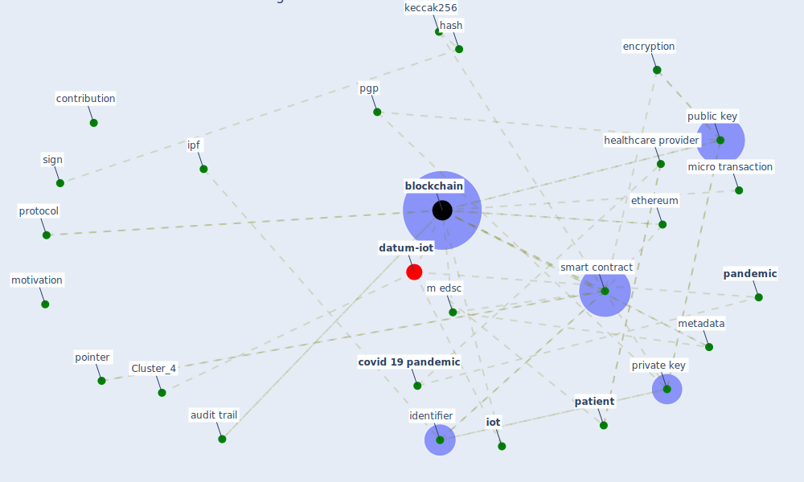

# Article: Health Information Exchange with Blockchain amid Covid-19-like Pandemics (christodoulou_health_2020)

* Source: [10.1109/DCOSS49796.2020.00071](https://doi.org/10.1109/DCOSS49796.2020.00071)
* Year: 2020
* Cluster: [iot-blockchain](cluster_7)

## Keywords

 * I ii, asymmetric cryptography, asynchronous, audit trail, authenticate, authentication, [blockchain](keyword_blockchain), blockchain block, [blockchain technology](keyword_blockchain_technology), [canada](keyword_canada), client side, cloudlet, consensus algorithm, content identifier, contribution, confidentiality, [covid 19 pandemic](keyword_covid_19_pandemic), [covid-19](keyword_covid-19), cryptographically sign metadata, cyber, cybersecurity, data redundancy, datum acquisition, [datum protection](keyword_datum_protection), [decentralize](keyword_decentralize), [design](keyword_design), design consideration, digitalization, discrete wavelet transform, distribute computing, distribute datum storage, e-health, economic implication, ehr, encrypt, encryption, engineering management, [ethereum](keyword_ethereum), gateway, [government](keyword_government), greece, hash, hash algorithm, hash value, health care system, health information exchange, healthcare provider, identifier, immutability, implementation, implementation detail, [internet of thing](keyword_internet_of_thing), interoperability, interplanetary file system, [iot](keyword_iot), [ipf](keyword_ipf), ipfs retrieve, keccak256, key management component, library, m edsc, medea, [medical](keyword_medical), medrec, metadata, micro transaction, miscommunication, [misinformation](keyword_misinformation), mississauga, motivation, openpgp, p ubm d, p ubp, [pandemic](keyword_pandemic), [patient](keyword_patient), peer to peer, pgp, pointer, [privacy](keyword_privacy), private key, proof of work, [protocol](keyword_protocol), [public key](keyword_public_key), pulse oximet, santorini, securely encrypt, sense network, [sign](keyword_sign), [smart contract](keyword_smart_contract), storage, swarm, synchronous, [transmission](keyword_transmission), [united nations](keyword_united_nations), user centric, validation, wearable device, wood, [world health organization](keyword_world_health_organization), file

## Concepts

 

## Neighbours

### Closest articles

* Blockchain technology and its applications to combat COVID-19 pandemic - [LINK](article_sharma_blockchain_2022)
* How Can Blockchain Help People in the Event of Pandemics Such as the COVID-19? - [LINK](article_chang_how_2020)
* Leveraging Digital Transformation Technologies to Tackle COVID-19: Proposing a Privacy-First Holistic Framework - [LINK](article_arpaci_leveraging_2021)
* A Comprehensive Review of the COVID-19 Pandemic and the Role of IoT, Drones, AI, Blockchain, and 5G in Managing its Impact - [LINK](article_chamola_comprehensive_2020)
* Emerging Technologies to Combat the COVID-19 Pandemic - [LINK](article_vaishya_emerging_2020)
* The role of 5G for digital healthcare against COVID-19 pandemic: Opportunities and challenges - [LINK](article_siriwardhana_role_2021)
* Digital technology and COVID-19 - [LINK](article_ting_digital_2020)
* Combating COVID-19—The role of robotics in managing public health and infectious diseases - [LINK](article_yang_combating_2020)
* Danish disinfection robots save lives in the fight against the Corona virus \textbar Shaping Europe’s digital future - [LINK](article_ec_views_danish_2020)

### Closest BPs

* Blueprint: Resilience in staffing and skills training - [LINK](bp_12)
* Blueprint: Installing UV in ductwork - [LINK](bp_10)
* Blueprint: Negative pressure rooms - [LINK](bp_13)
