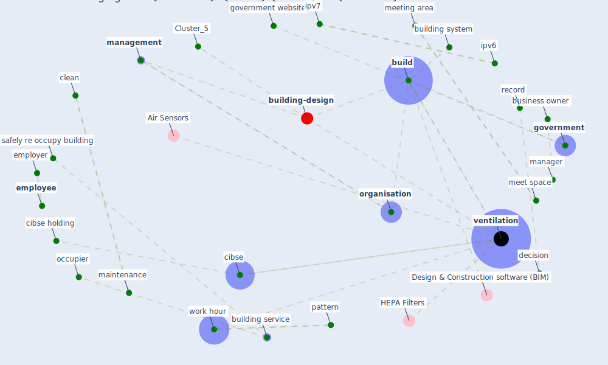

# Article: Emerging from Lockdown: CIBSE COVID-19 Guidance (cibse_emerging_2020)

* [https://www.cibse.org/knowledge-research/knowledge-resources/engineering-guidance/emerging-from-lockdown-cibse-covid-19-guidance](https://www.cibse.org/knowledge-research/knowledge-resources/engineering-guidance/emerging-from-lockdown-cibse-covid-19-guidance)
* Year: 2020
* Cluster: [building-energy](cluster_2)

## Keywords

 * access control, [airborne](keyword_airborne), assembly point, battery, [build](keyword_build), building entrance and exit protocol, building manager, building service, building service engineer, building system, [business](keyword_business), business owner, charter, charter institution of building service engineer london, cibse, cibse holding, circulation space, [clean](keyword_clean), [coronavirus](keyword_coronavirus), coronavirus covid 19, coronavirus covid 19 outbreak, covid 19 epidemic, [covid-19](keyword_covid-19), decision, door handle, emergency exit and mean of escape, emergency exit route, emergency lighting, emergency system, [employee](keyword_employee), [employer](keyword_employer), en 50172, [engineer](keyword_engineer), escape route, fire detection system, furniture, furniture plan, further guidance, gas safety inspection and maintenance, gas supply, [government](keyword_government), government website, health and safety relate hazard, health risk, heating system, hse, hygiene, [infection](keyword_infection), ipv6, ipv7, legionnaires philis, level ofoccupancy, life safety system, lift, lift car, [lockdown](keyword_lockdown), low risk, [maintenance](keyword_maintenance), maintenance contractor, [management](keyword_management), management consideration, [manager](keyword_manager), meet space, meeting area, method statement, minimise, new website, occupier, occupy area, [organisation](keyword_organisation), otherボールguidance, otherポguidance, pattern, pre heating season service check, record, register, [risk](keyword_risk), risk assessment, safe method of work, safely re occupy building, [safety](keyword_safety), security system, self employ, shift, society of light and lighting guidance, sprinkler, stagger, [surface](keyword_surface), surface contact, testing, time of operation, [transmission](keyword_transmission), union, [united kingdom](keyword_united_kingdom), [ventilation](keyword_ventilation), visitor screen, [window](keyword_window), [work](keyword_work), work hour, [worker](keyword_worker)

## Concepts

 

## Neighbours

### Closest articles

* Should I Stay or Should I Go? Tourists’ COVID-19 Risk Perception and Vacation Behavior Shift - [LINK](article_bratic_should_2021)
* Seeing the invisible hand: Underlying effects of COVID-19 on tourists’ behavioral patterns - [LINK](article_li_seeing_2020)
* Coronavirus and Climate Change - [LINK](article_harvard_th_chan_schoold_of_public_health_coronavirus_2020)
* Mobility Behaviour in View of the Impact of the COVID-19 Pandemic—Public Transport Users in Gdansk Case Study - [LINK](article_przybylowski_mobility_2021)
* Responsible Transport: A post-COVID agenda for transport policy and practice - [LINK](article_budd_responsible_2020)
* What our response to the COVID-19 pandemic tells us of our capacity to respond to climate change - [LINK](article_gemenne_what_2020)
* COVID-19 risks and systemic gaps in Nigeria: resilience building lessons for pandemic and climate change management - [LINK](article_lawal_covid-19_2022)
* Navigating Climate Change: Rethinking the Role of Buildings - [LINK](article_cole_navigating_2020)

### Closest BPs

* Blueprint: Mental health – Belong: Do something with someone - [LINK](bp_19)
* Blueprint: Mental health – Commit: Do something meaningfull - [LINK](bp_20)
* Blueprint: Mental health – Act: Do something - [LINK](bp_18)
