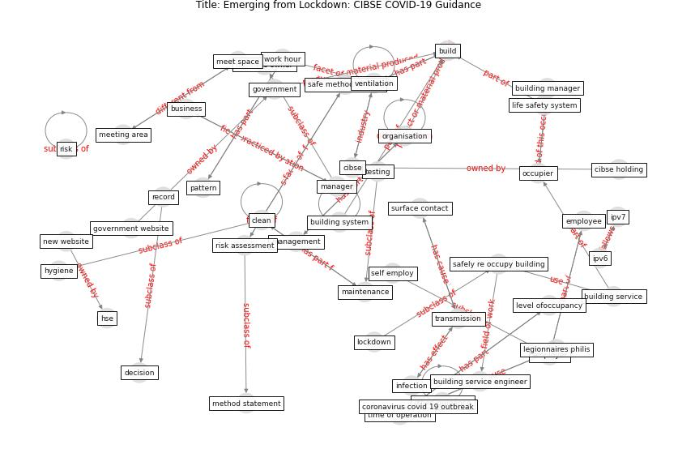

# Article: Emerging from Lockdown: CIBSE COVID-19 Guidance (cibse_emerging_2020)

* [https://www.cibse.org/knowledge-research/knowledge-resources/engineering-guidance/emerging-from-lockdown-cibse-covid-19-guidance](https://www.cibse.org/knowledge-research/knowledge-resources/engineering-guidance/emerging-from-lockdown-cibse-covid-19-guidance)
* Year: 2020
* Cluster: [building-space](cluster_1)

## Keywords

 * access control, [airborne](keyword_airborne), assembly point, battery, [build](keyword_build), building entrance and exit protocol, building manager, building service, building service engineer, building system, [business](keyword_business), business owner, charter, charter institution of building service engineer london, cibse, cibse holding, circulation space, [clean](keyword_clean), [coronavirus](keyword_coronavirus), coronavirus covid 19, coronavirus covid 19 outbreak, covid 19 epidemic, [covid-19](keyword_covid-19), decision, door handle, emergency exit and mean of escape, emergency exit route, emergency lighting, emergency system, [employee](keyword_employee), [employer](keyword_employer), en 50172, [engineer](keyword_engineer), escape route, fire detection system, furniture, furniture plan, further guidance, gas safety inspection and maintenance, gas supply, [government](keyword_government), government website, health and safety relate hazard, health risk, heating system, hse, hygiene, [infection](keyword_infection), ipv6, ipv7, legionnaires philis, level ofoccupancy, life safety system, lift, lift car, [lockdown](keyword_lockdown), low risk, maintenance, maintenance contractor, management, management consideration, [manager](keyword_manager), meet space, meeting area, method statement, minimise, new website, occupier, occupy area, [organisation](keyword_organisation), otherボールguidance, otherポguidance, pattern, pre heating season service check, record, register, [risk](keyword_risk), risk assessment, safe method of work, safely re occupy building, [safety](keyword_safety), security system, self employ, shift, society of light and lighting guidance, sprinkler, stagger, [surface](keyword_surface), surface contact, testing, time of operation, [transmission](keyword_transmission), union, [united kingdom](keyword_united_kingdom), [ventilation](keyword_ventilation), visitor screen, [window](keyword_window), [work](keyword_work), work hour, [worker](keyword_worker)

## Concepts

 

## Neighbours

### Closest articles

* A review of definitions and measures of system resilience - [LINK](article_hosseini_review_2016)
* Guidelines for resilience systems analysis - [LINK](article_oecd_guidelines_2014)
* Strengthening resilience: a priority shared by Health 2020 and - [LINK](article_who_strengthening_2017)
* COVID-19 and a new resilient infrastructure landscape - [LINK](article_oecd_covid-19_2021)
* Preparing critical infrastructure for the future: Lessons learnt from the Covid-19 pandemic - [LINK](article_tomalska_preparing_2022)
* COVID-19 as a Harbinger of Transforming Infrastructure Resilience - [LINK](article_carvalhaes_covid-19_2020)
* DeepSOCIAL: Social Distancing Monitoring and Infection Risk Assessment in COVID-19 Pandemic - [LINK](article_rezaei_deepsocial_2020)
* DfMA for rapid adaptive resilience and flexible infrastructure - [LINK](article_mott_macdonald_dfma_2020)
* Towards the sustainable development of smart cities through mass video surveillance: A response to the COVID-19 pandemic - [LINK](article_shorfuzzaman_towards_2021)

### Closest BPs

* Blueprint: Resilience in staffing and skills training - [LINK](bp_12)
* Blueprint: Smart Locker System - [LINK](bp_1)
* Blueprint: Rotational Shift System - [LINK](bp_0)
