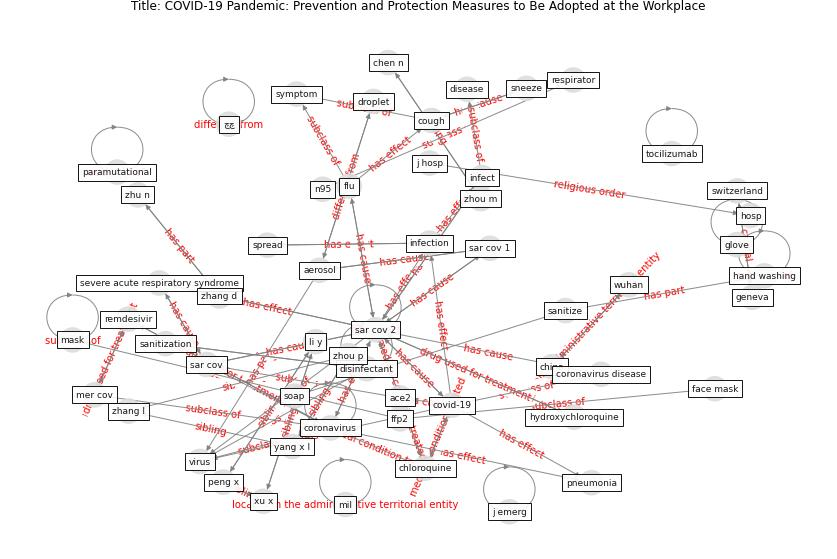

# Article: COVID-19 Pandemic: Prevention and Protection Measures to Be Adopted at the Workplace (cirrincione_covid-19_2020)

* Source: [10.3390/su12093603](https://doi.org/10.3390/su12093603)
* Year: 2020
* Cluster: [air-ventilation](cluster_13)

## Keywords

 * 6espiritually, ace2, [aerosol](keyword_aerosol), antibodie, [antiviral](keyword_antiviral), articolo pubblicato, chen n, [china](keyword_china), chloroquine, completely useless, [coronavirus](keyword_coronavirus), coronavirus disease, cough, [covid-19](keyword_covid-19), curr, [disease](keyword_disease), [disinfectant](keyword_disinfectant), [droplet](keyword_droplet), environmental measure, [epidemic](keyword_epidemic), [epidemiological](keyword_epidemiological), [face mask](keyword_face_mask), facial filter, favipiravir, ffp2, ffp3, filter mask, flu, geneva, glove, goggle, gs 5734, hand, hand washing, hosp, hydroxychloroquine, hypochlorite, infect, [infection](keyword_infection), infectious, j emerg, j hosp, li y, low respiratory tract, lu w, [mask](keyword_mask), [mer cov](keyword_mer_cov), mil, mouth, n95, nose, paramutational, [pathogen](keyword_pathogen), peng x, [personal protective equipment](keyword_personal_protective_equipment), pneumonia, prevention and protection, protection, remdesivir, respir, respirator, safety goggle, sanitization, sanitize, sar cov, [sar cov 1](keyword_sar_cov_1), [sar cov 2](keyword_sar_cov_2), severe acute respiratory syndrome, sheahan, shiu e y, smart working, sneeze, soap, [spread](keyword_spread), surgical mask, [switzerland](keyword_switzerland), [symptom](keyword_symptom), t p, technical standard, tellier r, tocilizumab, [transmission](keyword_transmission), [usa](keyword_usa), [vaccine](keyword_vaccine), [virus](keyword_virus), [world health organization](keyword_world_health_organization), [wuhan](keyword_wuhan), xing b, xu x, yang x l, zhang d, zhang l, zhang q, zhonghua l, zhou m, zhou p, zhou x, zhu n, چچ, چک

## Concepts

 

## Neighbours

### Closest articles

* COVID-19 and its Modes of Transmission - [LINK](article_karia_covid-19_2020)
* Current knowledge of COVID-19: Advances, challenges and future perspectives - [LINK](article_wu_current_2021)
* COVID-19: Risk assessment and mitigation measures in healthcare and non-healthcare workplaces - [LINK](article_fawzy_covid-19_2021)
* Persistence of coronaviruses on inanimate surfaces and their inactivation with biocidal agents - [LINK](article_kampf_persistence_2020)
* Sustainability of Coronavirus on Different Surfaces - [LINK](article_suman_sustainability_2020)
* COVID-19 Prevention and Control Measures in Workplace Settings: A Rapid Review and Meta-Analysis - [LINK](article_ingram_covid-19_2021)
* Physical interventions to interrupt or reduce the spread of respiratory viruses: systematic review - [LINK](article_jefferson_physical_2008)
* Aerosol and Surface Stability of SARS-CoV-2 as Compared with SARS-CoV-1 - [LINK](article_van_doremalen_aerosol_2020)
* SARS-CoV-2 RNA detection of hospital isolation wards hygiene monitoring during the Coronavirus Disease 2019 outbreak in a Chinese hospital - [LINK](article_wang_sars-cov-2_2020)
* Air, Surface Environmental, and Personal Protective Equipment Contamination by Severe Acute Respiratory Syndrome Coronavirus 2 (SARS-CoV-2) From a Symptomatic Patient - [LINK](article_ong_air_2020)

### Closest BPs

* Blueprint: Installing high-efficiency air filters - [LINK](bp_11)
* Blueprint: Antimicrobial Surfaces - [LINK](bp_5)
* Blueprint: Good hand hygiene practice - [LINK](bp_16)
