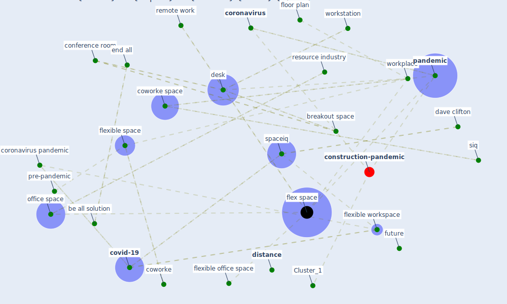

# Article: The COVID-19 Impact on Flexible Office Space (clifton_covid-19_2020)

* [https://spaceiq.com/blog/covid-19-impact-on-flexible-office-space/](https://spaceiq.com/blog/covid-19-impact-on-flexible-office-space/)
* Year: 2020
* Cluster: [construction-pandemic](cluster_1)

## Keywords

 * 2008 summer olympic, adaptation, archibus, be all, be all solution, [beijing](keyword_beijing), breakout space, cern, clientelee, concept, conference room, contact trace, [control](keyword_control), [coronavirus](keyword_coronavirus), coronavirus pandemic, covid 19 impact on flexible office space, [covid-19](keyword_covid-19), coworke, coworke space, cubicle farm, [customer](keyword_customer), customer e take, customer e take coworke, dave clifton, david clifton, demo, demo e not at all, demo exposure, [desk](keyword_desk), desk neighborhood, [distance](keyword_distance), e workplace, [employee](keyword_employee), [employer](keyword_employer), end all, face to face, face to face interaction, facility, facility manager, [flex space](keyword_flex_space), flexible office, flexible office dead, flexible office space, flexible space, flexible space market, flexible workplace, flexible workspace, flexspace, floor plan, future, future hold, hot desk, hotel desk, ibm, ibm research, ibm watson, integrate workplace management system, [interaction](keyword_interaction), jll, m I l by dave clifton, market research, market research firm, market share, office depot, office space, [pandemic](keyword_pandemic), pandemic run its course, [people](keyword_people), pivot, post-pandemic, pre-pandemic, problem, [remote work](keyword_remote_work), resource industry, saas privacy policy, safeguard, san francisco, san francisco california, share k, shut their door, siq, software, [solution](keyword_solution), [space](keyword_space), [spaceiq](keyword_spaceiq), spaceiq com, spaceiq e, [standard](keyword_standard), standard for contact trace, uncertainty, website privacy policy, website privacy statement, work space, [workplace](keyword_workplace), workplace environment, workplace management system, workplace policy, [workstation](keyword_workstation)

## Concepts

 

## Neighbours

### Closest articles

* It’s time to reimagine where and how work will get done (PwC’s US Remote Work Survey) - [LINK](article_pricewaterhousecoopers_its_2021)
* A study on office workplace modification during the COVID-19 pandemic in The Netherlands - [LINK](article_hou_study_2021)
* Architectural Design Drives the Biogeography of Indoor Bacterial Communities - [LINK](article_kembel_architectural_2014)
* COVID-19 Experience Transforming the Protective Environment of Office Buildings and Spaces - [LINK](article_phapant_covid-19_2021)
* Adaptive Design of the Built Environment to Mitigate the Transmission Risk of COVID-19 - [LINK](article_ara_dilshad_shangi_adaptive_2020)
* The contribution of green buildings in the fight against COVID-19 - [LINK](article_world_green_building_council_contribution_2020)
* How our homes impact our health: using a COVID-19 informed approach to examine urban apartment housing - [LINK](article_peters_how_2020)
* COVID-19 Lessons for a Resilient Built Environment: A Roadmap - [LINK](article_hull_covid-19_2020)
* Health, Wellbeing \& Productivity in Offices - [LINK](article_world_green_building_council_health_2014)
* Towards Resilient Residential Buildings and Neighborhoods in Light of COVID-19 Pandemic—The Scenario of Podgorica, Montenegro - [LINK](article_bojovic_towards_2022)

### Closest BPs

* Blueprint: Building Adaptation during a pandemic - [LINK](bp_14)
* Blueprint: Tracking and enforcing use of Personal Protective Equipment - [LINK](bp_23)
* Blueprint: Architecture design - [LINK](bp_2)
