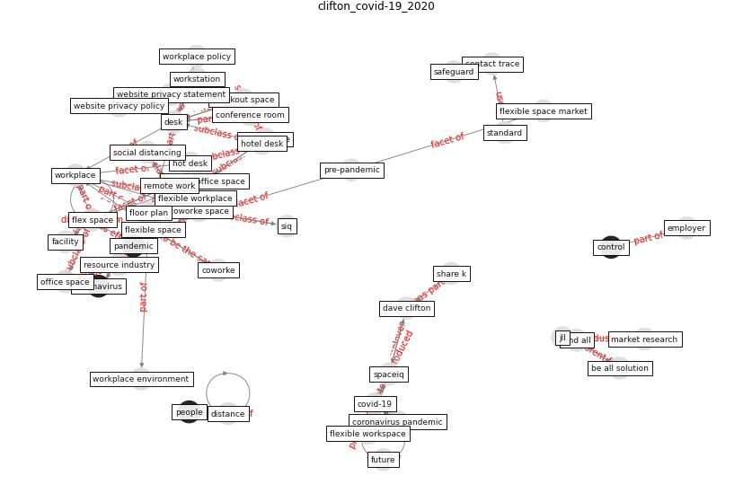

# Article: __The COVID-19 Impact on Flexible Office Space__ (clifton_covid-19_2020)

* URL: [https://spaceiq.com/blog/covid-19-impact-on-flexible-office-space/](https://spaceiq.com/blog/covid-19-impact-on-flexible-office-space/)
* Year: 2020
* Abstract: Are flexible workspaces safe during the coronavirus
pandemic? Let’s take a look at the relationship between
coronavirus, flexible workspaces and what to expect.

## Keywords

* [flex space](keyword_flex_space), [covid-19](keyword_covid-19), [desk](keyword_desk), [workplace](keyword_workplace), [spaceiq](keyword_spaceiq), [coworke](keyword_coworke), [pandemic](keyword_pandemic), [office space](keyword_office_space), [conference room](keyword_conference_room), [flexible space](keyword_flexible_space), [coworke space](keyword_coworke_space), flexible office space, flexible workspace, floor plan, [remote work](keyword_remote_work)

## Keywords at large

* [flex space](keyword_flex_space), [covid-19](keyword_covid-19), [desk](keyword_desk), [workplace](keyword_workplace), [spaceiq](keyword_spaceiq), [conference room](keyword_conference_room), [office space](keyword_office_space), [flexible space](keyword_flexible_space), [coworke space](keyword_coworke_space), [coworke](keyword_coworke)

## Concepts

 

### Closest articles 

* [A study on office workplace modification during the COVID-19 pandemic in The Netherlands](article_hou_study_2021)
* [It’s time to reimagine where and how work will get done
(PwC’s US Remote Work Survey)](article_pricewaterhousecoopers_its_2021)
* [COVID-19 Experience Transforming the Protective Environment of Office Buildings and Spaces](article_phapant_covid-19_2021)
* [Adaptive Design of the Built Environment to Mitigate the Transmission Risk of COVID-19](article_ara_dilshad_shangi_adaptive_2020)
* [RESIDENTIAL ARCHITECTURE IN A POST-PANDEMIC WORLD: IMPLICATIONS OF COVID-19 FOR NEW CONSTRUCTION AND FOR ADAPTING HERITAGE BUILDINGS](article_spennemann_residential_2021)
* [Architectural Design Drives the Biogeography of Indoor Bacterial Communities](article_kembel_architectural_2014)
* [Health, Wellbeing \& Productivity in Offices](article_world_green_building_council_health_2014)
* [How the Coronavirus Will Reshape Architecture](article_chayka_how_2020)
* 
* [How is COVID-19 Experience Transforming Sustainability Requirements of Residential Buildings? A Review](article_tokazhanov_how_2020)

