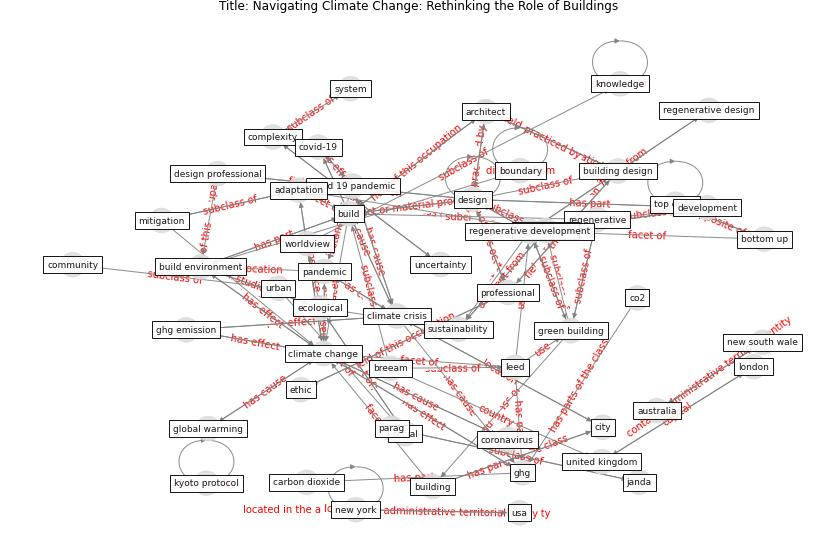

# Article: __Navigating Climate Change: Rethinking the Role of Buildings__ (cole_navigating_2020)

* [10.3390/su12229527](https://doi.org/10.3390/su12229527)
* Cluster: [building-space](cluster_7)

## Keywords

[design](keyword_design), [build](keyword_build), [community](keyword_community), [pandemic](keyword_pandemic)

## Abstract

This paper focuses on the design of buildings as part of
society’s response to the climate crisis in the aftermath
of the COVID-19 pandemic. It draws on a broad literature to
address two interrelated goals—first, to align
regenerative development and design with the necessary
bottom-up adaptation strategies and human agency, and
second, to identify new, broader possible roles of
buildings and responsibilities of design professionals.
This required a comparison of current green building and
emerging regenerative approaches and identifying the
relevant characteristics of top-down and bottom-up
mechanisms. The paper accepts that adaptation to climate
change will, to a large extent, depend on people’s
day-to-day actions in the places they live, and argues that
the built environment will have to be infused with the
capability to enable inhabitants’ greater agency. Viewing
buildings as playing a connective role in the existing
urban fabric seriously challenges the primacy of the
individual building as the focus of environmental
strategies. The roles of building design professionals will
likely expand to include mediating between top-down imposed
government controls and increasing bottom-up
neighborhood-scale social activism.

## Concepts

 

