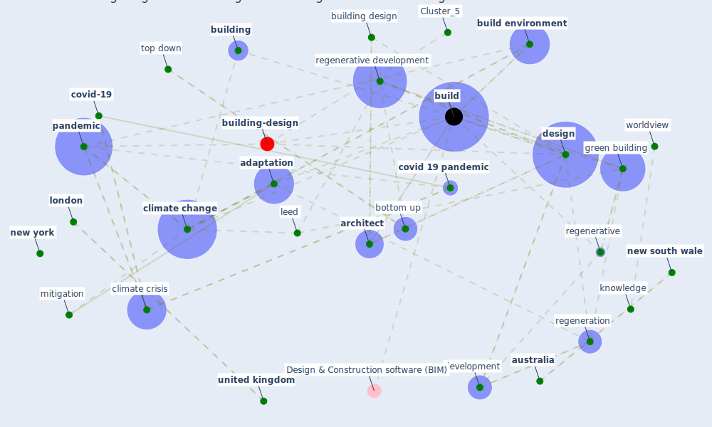

# Article: Navigating Climate Change: Rethinking the Role of Buildings (cole_navigating_2020)

* Source: [10.3390/su12229527](https://doi.org/10.3390/su12229527)
* Year: 2020
* Cluster: [building-energy](cluster_2)

## Keywords

 * adaptation, anthropocentric, [architect](keyword_architect), assessment method, [australia](keyword_australia), bad, bc, [biodiversity loss](keyword_biodiversity_loss), bottom up, boundary, [breeam](keyword_breeam), [build](keyword_build), [build environment](keyword_build_environment), [building](keyword_building), building design, [canada](keyword_canada), carbon dioxide, carbon emission, [change](keyword_change), [city](keyword_city), [climate](keyword_climate), [climate change](keyword_climate_change), climate change mitigation, climate crisis, climb, co2, colburn, cole, [community](keyword_community), complexity, [coronavirus](keyword_coronavirus), [covid 19 pandemic](keyword_covid_19_pandemic), [covid-19](keyword_covid-19), [design](keyword_design), design professional, development, du plessis, ecological, ecology, environmental, ethic, [france](keyword_france), ghg, ghg emission, [green building](keyword_green_building), green building council, greenhouse gas, [impact](keyword_impact), janda, [knowledge](keyword_knowledge), kraków, kyoto protocol, [leed](keyword_leed), level of government, lisa, [london](keyword_london), mang, [manhattan](keyword_manhattan), master planning, mechanistic, [mitigation](keyword_mitigation), [neighborhood](keyword_neighborhood), [new south wale](keyword_new_south_wale), [new york](keyword_new_york), new york university, [pandemic](keyword_pandemic), parag, paris, [people](keyword_people), [poland](keyword_poland), [process](keyword_process), [professional](keyword_professional), reductive, reed, regeneration, regenerative, regenerative design, regenerative development, regulation, regulatory body, [risk](keyword_risk), [social](keyword_social), [society](keyword_society), [stakeholder](keyword_stakeholder), [standard](keyword_standard), story, [sustainability](keyword_sustainability), [switzerland](keyword_switzerland), [system](keyword_system), [technology](keyword_technology), tijuana, top down, uncertainty, [united kingdom](keyword_united_kingdom), [united nations](keyword_united_nations), [urban](keyword_urban), [usa](keyword_usa), vancouver, vt, worldview

## Concepts

 

## Neighbours

### Closest articles

* COVID-19 risks and systemic gaps in Nigeria: resilience building lessons for pandemic and climate change management - [LINK](article_lawal_covid-19_2022)
* Revisiting the built environment: 10 potential development changes and paradigm shifts due to COVID-19 - [LINK](article_cheshmehzangi_revisiting_2021)
* What our response to the COVID-19 pandemic tells us of our capacity to respond to climate change - [LINK](article_gemenne_what_2020)
*  - [LINK](article_yakubu_aminu_dodo_green_2020)
* Coronavirus and Climate Change - [LINK](article_harvard_th_chan_schoold_of_public_health_coronavirus_2020)
* Smart cities and a data-driven response to COVID-19 - [LINK](article_james_smart_2020)
* Smart cities and the pandemic: digital technologies on the urban management of Brazilian cities - [LINK](article_fariniuk_smart_2020)
* The three modes of existence of the pandemic smart city - [LINK](article_soderstrom_three_2021)
* The Smart City and Covid‐19 - [LINK](article_webb_smart_2020)

### Closest BPs

* Blueprint: Smart Locker System - [LINK](bp_1)
* Blueprint: Mental health – Belong: Do something with someone - [LINK](bp_19)
* Blueprint: Mental health – Act: Do something - [LINK](bp_18)
