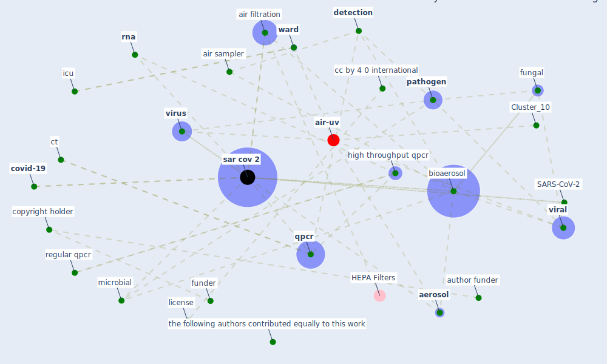

# Article: The removal of airborne SARS-CoV-2 and other microbial bioaerosols by air filtration on COVID-19 surge units (conway-morris_removal_2021)

* Source: [10.1101/2021.09.16.21263684](https://doi.org/10.1101/2021.09.16.21263684)
* Year: 2021
* Cluster: [air-sars](cluster_9)

## Keywords

 * SARS-CoV-2, addenbrooke s hospital, [aerosol](keyword_aerosol), aerosolise, [air filter](keyword_air_filter), air filtration, air sampler, airborne sar cov 2, atlanta, [author funder](keyword_author_funder), b c candida, background, [bacteria](keyword_bacteria), bar chart, bay, bed, [bioaerosol](keyword_bioaerosol), bioaerosol detections, bushmaker t, cambridge university hospital nhs foundation trust, candida, cc by 4 0 international, chest, clin infect dis, con, [control](keyword_control), [copyright holder](keyword_copyright_holder), corman, [covid 19 pandemic](keyword_covid_19_pandemic), [covid-19](keyword_covid-19), ct, [detection](keyword_detection), e coli, [elementary school](keyword_elementary_school), emerg infect dis, extract, [filter](keyword_filter), fresh air, funder, funding, fungal, hamed i, health research, hierarchy of control, high throughput, high throughput qpcr, [hospital](keyword_hospital), hsv1, [icu](keyword_icu), infect dis, [influenza](keyword_influenza), ja, license, lindsley wg, ljubljana, lung, mann whitney u test, manuscript, [microbial](keyword_microbial), microfluidic, n van doremalen n, nasopharyngeal, niosh, nucleic acid, ongoing pandemic, organism, p 0 05, [pandemic](keyword_pandemic), [pathogen](keyword_pathogen), qpcr, rad box, regular qpcr, rna, room layout, ruden h, [sample](keyword_sample), sampler, [sar cov 1](keyword_sar_cov_1), [sar cov 2](keyword_sar_cov_2), sar cov 2 1, sar cov 2 rna, sar cov 2 transmission, sar cov 27, service evaluation, shaban n, [slovenia](keyword_slovenia), small, stack, stacked bar chart, staph, surge, the following authors contributed equally to this work, type, [united kingdom](keyword_united_kingdom), [ventilation](keyword_ventilation), [viral](keyword_viral), [virus](keyword_virus), vm, [ward](keyword_ward), wellcome trust

## Concepts

 

## Neighbours

### Closest articles

* Real-world data show that filters clean COVID-causing virus from air - [LINK](article_thompson_real-world_2021)
* Architectural design strategies for infection prevention and control (IPC) in health-care facilities: towards curbing the spread of Covid-19 \textbar SpringerLink - [LINK](article_udomiaye_architectural_2020)
* A Review on Building Design as a Biomedical System for Preventing COVID-19 Pandemic - [LINK](article_amran_review_2022)
* Indoor Air Quality: Rethinking rules of building design strategies in post-pandemic architecture - [LINK](article_megahed_indoor_2021)
* A Global Survey of Infection Control and Mitigation Measures for Combating the Transmission of COVID-19 Pandemic in Buildings Under Facilities Management Services - [LINK](article_sarvari_global_2022)
* COVID-19 Forced Hospitals to Build Negative Pressure Rooms Fast - [LINK](article_dyer_covid-19_2020)
* A review of facilities management interventions to mitigate respiratory infections in existing buildings - [LINK](article_zhang_review_2022)
* Rapid expansion of temporary, reliable airborne-infection isolation rooms with negative air machines for critical COVID-19 patients - [LINK](article_lee_rapid_2020)

### Closest BPs

* Blueprint: Installing high-efficiency air filters - [LINK](bp_11)
* Blueprint: Negative pressure rooms - [LINK](bp_13)
* Blueprint: Installing UV in ductwork - [LINK](bp_10)
