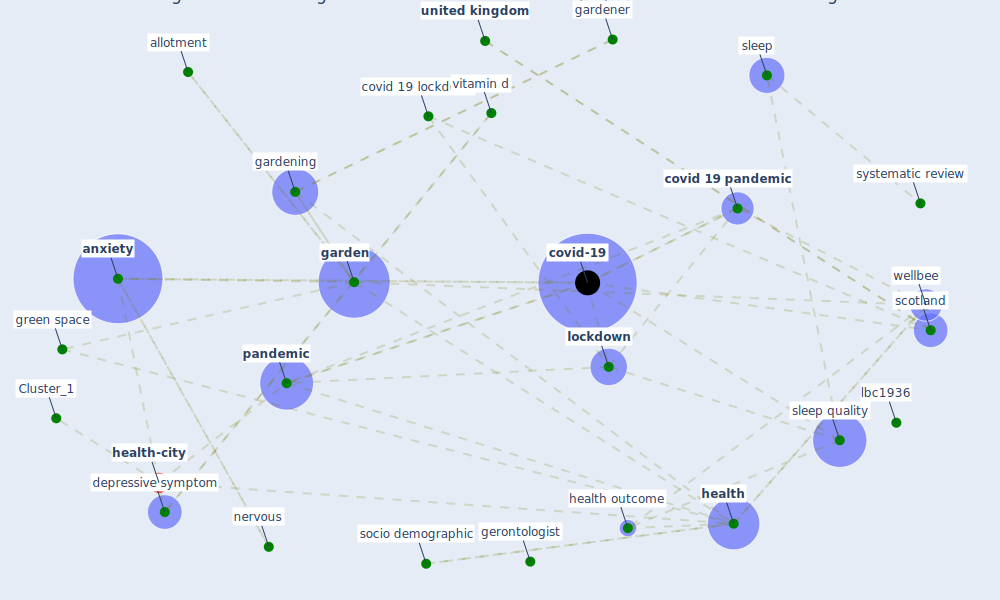

# Article: Home garden use during COVID-19: Associations with physical and mental wellbeing in older adults (corley_home_2021)

* Source: [10.1016/j.jenvp.2020.101545](https://doi.org/10.1016/j.jenvp.2020.101545)
* Year: 2021
* Cluster: [health-mental](cluster_10)

## Keywords

 * 1 excellent, 4 point scale, about the same now, age, allotment, [anxiety](keyword_anxiety), before, behavior, c milligan c gatrell a bingley, cardiovascular disease, cognitive, covid 19 lockdown, [covid 19 pandemic](keyword_covid_19_pandemic), [covid-19](keyword_covid-19), cross sectional, cvd, deary, declaration of interest, deficiency, [depression](keyword_depression), [depressive symptom](keyword_depressive_symptom), [diabete](keyword_diabete), domestic garden, edinburgh, educate, [environment](keyword_environment), female, ferrini, [garden](keyword_garden), garden access, garden predictor variable, gardener, [gardening](keyword_gardening), gaston, gatrell a bingley, gerontologist, gori, [green space](keyword_green_space), greenspace, [health](keyword_health), health outcome, health promotion, health relate variable, [italy](keyword_italy), janie corley, jime nez pavo n, jones, krupa, landscape, lbc1936, lifestyle, lock down, [lockdown](keyword_lockdown), lothian, maheswaran, male, marselle, [meta analysis](keyword_meta_analysis), [model](keyword_model), nazroo, nervous, nieboer, no garden access, nongardener, overbeek, p 0 05, [pandemic](keyword_pandemic), pattie, physiological, pre lockdown, press, psychiatry, [psychological](keyword_psychological), psychology, [psychosocial](keyword_psychosocial), relax, relax in the garden, relaxation, [research](keyword_research), scotland, scottish, significant association, since, [sleep](keyword_sleep), sleep quality, slightly less now, socio demographic, [stress](keyword_stress), systematic review, twohig bennett, [united kingdom](keyword_united_kingdom), university of london, [urban](keyword_urban), [urban planning](keyword_urban_planning), vitamin d, [well be](keyword_well_be), [wellbee](keyword_wellbee), why, yamaura, yes no relaxing in garden

## Concepts

 

## Neighbours

### Closest articles

* COVID-19 Lockdown: Housing Built Environment’s Effects on Mental Health - [LINK](article_amerio_covid-19_2020)
* Psychological Effects of Home Confinement and Social Distancing Derived from COVID-19 in the General Population—A Systematic Review - [LINK](article_rodriguez-fernandez_psychological_2021)
* The psychological impact of COVID-19 on the mental health in the general population - [LINK](article_serafini_psychological_2020)
* Mental Health and the Covid-19 Pandemic - [LINK](article_pfefferbaum_mental_2020)
* Association between indoor-outdoor green features and psychological health during the COVID-19 lockdown in Italy: A cross-sectional nationwide study - [LINK](article_spano_association_2021)
* Mental health and COVID-19 - [LINK](article_who_mental_2021)
* Green spaces, especially forest, linked to lower SARS-CoV-2 infection rates: A one-year nationwide study - [LINK](article_jiang_green_2021)
* The role of green roofs in post COVID-19 confinement: An analysis of willingness to pay - [LINK](article_manso_role_2021)
* Urban form: Realising the value of green space: a planners’ perspective on the COVID-19 pandemic - [LINK](article_ahmadpoor_urban_2021)
* The impact of the COVID-19 pandemic on the importance of urban green spaces to the public - [LINK](article_noszczyk_impact_2022)

### Closest BPs

* Blueprint: Building Adaptation during a pandemic - [LINK](bp_14)
* Blueprint: Architecture design - [LINK](bp_2)
* Blueprint: Tracking and enforcing use of Personal Protective Equipment - [LINK](bp_23)
