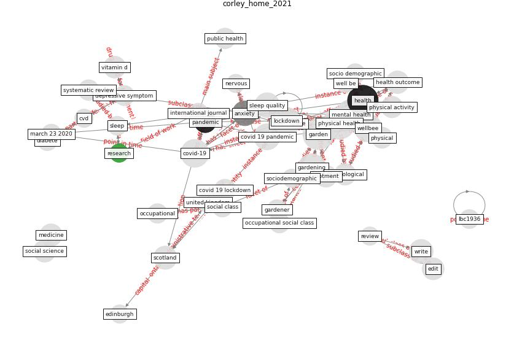

# Article: __Home garden use during COVID-19: Associations with physical and mental wellbeing in older adults__ (corley_home_2021)

* [10.1016/j.jenvp.2020.101545](https://doi.org/10.1016/j.jenvp.2020.101545)
* Cluster: [health-city](cluster_3)

## Keywords

[health](keyword_health)

## Concepts

 

### References 

* [Mental Health and the Covid-19 Pandemic](article_pfefferbaum_mental_2020)

### Cited by 

* [Prophylactic Architecture: Formulating the Concept
of Pandemic-Resilient Homes](article_elrayies_prophylactic_2022)* [Association between indoor-outdoor green features and
psychological health during the COVID-19 lockdown in
Italy: A cross-sectional nationwide study](article_spano_association_2021)
