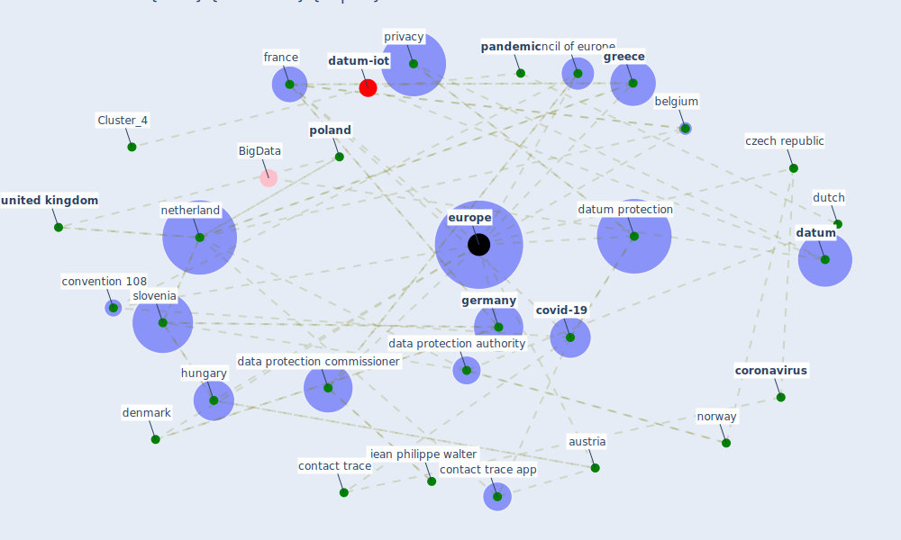

# Article: 2020 Data Protection Report (council_of_europe_2020_2020)

* [https://rm.coe.int/prems-120820-gbr-2051-digital-solutions-to-fight-covid-19-text-a4-web-/16809fe49c](https://rm.coe.int/prems-120820-gbr-2051-digital-solutions-to-fight-covid-19-text-a4-web-/16809fe49c)
* Year: 2020
* Cluster: [iot-blockchain](cluster_7)

## Keywords

 * andorra, antibodie, [austria](keyword_austria), azerbaijan, belgium, [bluetooth](keyword_bluetooth), [bulgaria](keyword_bulgaria), civil society, conseil d état, contact trace, contact trace app, [convention 108](keyword_convention_108), [coronavirus](keyword_coronavirus), council of europe, [covid 19 pandemic](keyword_covid_19_pandemic), [covid-19](keyword_covid-19), [crisis](keyword_crisis), [croatia](keyword_croatia), cyprus, czech republic, data protection authority, data protection commissioner, [datum](keyword_datum), datum processing, [datum protection](keyword_datum_protection), decentralise, [denmark](keyword_denmark), dpa, dutch, eindhoven, emergency measure, eu member state, [europe](keyword_europe), european convention on human right, european court of human right, [european union](keyword_european_union), [france](keyword_france), french, [germany](keyword_germany), gibraltar, [government](keyword_government), greece, [health](keyword_health), [health care](keyword_health_care), health crisis, hungary, [infection](keyword_infection), io, [italy](keyword_italy), jean philippe walter, kraków, latvia, [law](keyword_law), legislation, liechtenstein, lithuania, lithuanian, location, location datum, macedonia, mayor, metadata, ministry for health, monaco, [netherland](keyword_netherland), norway, [pandemic](keyword_pandemic), parliament, parliamentary assembly, [poland](keyword_poland), [privacy](keyword_privacy), privacy by design, private sector, proximity, proximity trace, public authority, [public health](keyword_public_health), [quarantine](keyword_quarantine), right, romania, [russia](keyword_russia), san marino, senegal, singapore, slovakia, [slovenia](keyword_slovenia), [sm](keyword_sm), [smartphone](keyword_smartphone), [society](keyword_society), spanish, supervisory authority, [sweden](keyword_sweden), [switzerland](keyword_switzerland), [symptom](keyword_symptom), telecommunication, [teleworke](keyword_teleworke), train, turkey, [united kingdom](keyword_united_kingdom), [virus](keyword_virus)

## Concepts

 

## Neighbours

### Closest articles

* Challenges of data sharing in European Covid-19 projects: A learning opportunity for advancing pandemic preparedness and response - [LINK](article_tacconelli_challenges_2022)
* Mapping research in logistics and supply chain management during COVID-19 pandemic - [LINK](article_montoya-torres_mapping_2021)
* Global value chains: Efficiency and risks in the context of COVID-19 - [LINK](article_oecd_global_2021)
* Mitigation strategies and compliance in the COVID-19 fight; how much compliance is enough? - [LINK](article_mukerjee_mitigation_2021)
* The Intelligent Lockdown: Compliance with COVID-19 Mitigation Measures in the Netherlands - [LINK](article_kuiper_intelligent_2020)
* Compliance with COVID-19 Mitigation Measures in the United States - [LINK](article_van_rooij_compliance_2020)

### Closest BPs

* Blueprint: Resilience in staffing and skills training - [LINK](bp_12)
* Blueprint: Installing high-efficiency air filters - [LINK](bp_11)
* Blueprint: Air Cleaning Plants - [LINK](bp_15)
