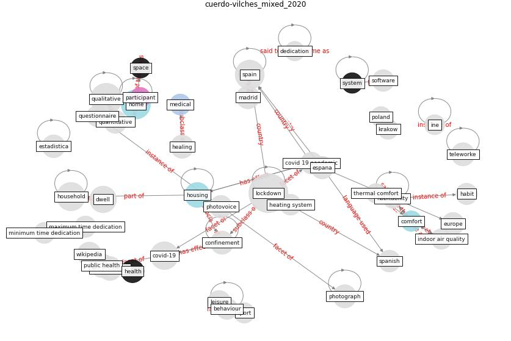

# Article: __A Mixed Approach on Resilience of Spanish Dwellings and Households during COVID-19 Lockdown__ (cuerdo-vilches_mixed_2020)

* [10.3390/su122310198](https://doi.org/10.3390/su122310198)
* Cluster: [building-space](cluster_7)

## Keywords

[home](keyword_home)

## Abstract

The confinement by COVID-19 has meant a re-reading of
housing for Spanish households, resulting in the only
available and safe space to carry out daily activity. This
complex phenomenon has generated a completely different way
of inhabiting it, as well as of relating to domestic
spaces. For this reason, the home perception and its
characteristics must be evaluated, highlighting those
perceived as deficiencies, or as preferences in such an
unusual context as lockdown, where the experience was
different depending on the dwelling characteristics, and
the family in question. To deepen in this double perception
home-dwelling, a mixed method was used, with two online
forms. The first is a quantitative questionnaire, while the
second asks the participants for photographs and narratives
about such images. More than 1800 surveys and 785
qualitative responses were obtained. From both approaches,
the joint discourse arose, allowing an exploratory analysis
of the current situation of the Spanish residential park,
and the resilience demonstrated in this period by both
households and their usual dwellings. This study should
facilitate the development of new proposals on housing in
contexts similar to the COVID-19 pandemic.

## Concepts

 

### References 

* [Antivirus-built environment: Lessons learned from
Covid-19 pandemic](article_megahed_antivirus-built_2020)

### Cited by 

* [Readiness Assessment of Green Building
Certification Systems for Residential Buildings
during Pandemics](article_tleuken_readiness_2021)
